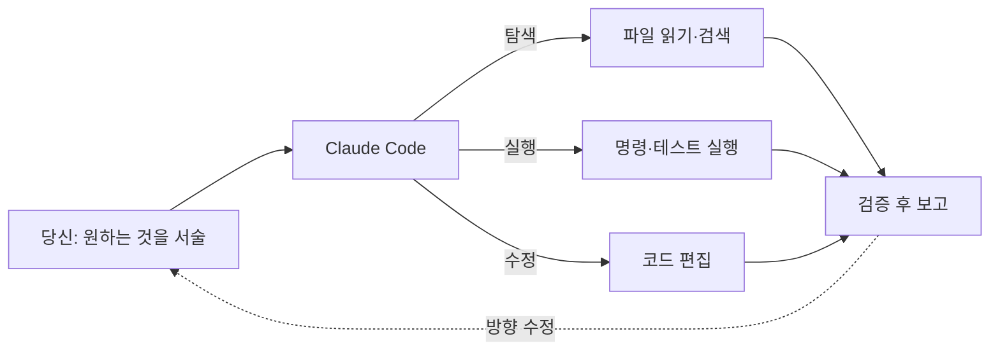

이 강의는 **Claude Code를 처음 켜는 순간부터 실무에서 여러 에이전트를 오케스트레이션하기까지**를 다룹니다. 이 첫 챕터는 "Claude Code가 대체 무엇이고, 내 컴퓨터에 어떻게 설치해 첫 세션을 여는가"에 답합니다.

## Claude Code란 무엇인가

Claude Code는 **터미널에서 동작하는 에이전틱(agentic) 코딩 도구**입니다. 질문에 답하고 기다리는 챗봇과 달리, Claude Code는 **당신의 파일을 직접 읽고, 명령을 실행하고, 코드를 수정하며, 문제를 스스로 풀어 나갑니다.** 당신은 그 과정을 지켜보거나, 방향을 바꾸거나, 아예 자리를 비울 수도 있습니다.

이것이 일하는 방식을 바꿉니다. 직접 코드를 짜서 Claude에게 리뷰를 부탁하는 대신, **원하는 것을 서술하면 Claude가 어떻게 만들지 알아냅니다** — 탐색하고, 계획하고, 구현합니다.



**어디서 쓸 수 있나:** 터미널 CLI가 기본이지만, **데스크톱 앱(Mac/Windows/Linux), 웹(claude.ai/code), IDE 확장(VS Code, JetBrains)**에서도 동일한 엔진을 씁니다. 이 강의는 CLI 기준으로 설명하지만 개념은 모든 곳에 적용됩니다.

> **필요 계정:** Claude Code는 **Pro, Max, Team, Enterprise, 또는 Console(API)** 계정이 필요합니다. **무료 Claude.ai 요금제로는 사용할 수 없습니다.** Amazon Bedrock, Google Vertex AI, Microsoft Foundry 같은 제3자 API 제공자로도 사용 가능합니다.

---

## 설치하기

**시스템 요구사항:** macOS 13+, Windows 10(1809)+, Ubuntu 20.04+/Debian 10+, 4GB+ RAM. 인터넷 연결 필요.

### 방법 1 — 네이티브 설치 (권장)

가장 간단하고, **백그라운드 자동 업데이트**를 지원합니다.

```bash
# macOS · Linux · WSL
curl -fsSL https://claude.ai/install.sh | bash
```

```powershell
# Windows PowerShell
irm https://claude.ai/install.ps1 | iex
```

### 방법 2 — 패키지 매니저

```bash
brew install --cask claude-code          # macOS (Homebrew)
```

```powershell
winget install Anthropic.ClaudeCode      # Windows (WinGet)
```

```bash
npm install -g @anthropic-ai/claude-code # npm (Node.js 22+ 필요)
```

> Homebrew·WinGet·npm 설치는 자동 업데이트되지 않습니다 — 각각 `brew upgrade claude-code`, `winget upgrade Anthropic.ClaudeCode`, `npm install -g @anthropic-ai/claude-code@latest`로 갱신하세요. **`sudo npm install -g`는 권한 문제·보안 위험 때문에 금지.**

### 설치 확인

```bash
claude --version     # 예: 2.1.211 (Claude Code)
claude doctor        # 설치·설정 진단 (세션을 열지 않고 점검만)
```

> **Windows 팁:** 네이티브 Windows에서 [Git for Windows](https://git-scm.com/downloads/win)를 설치하면 Bash 도구를 쓸 수 있습니다(없으면 PowerShell 사용). 리눅스 툴체인이나 샌드박싱이 필요하면 **WSL 2**를 권장합니다.

---

## 첫 세션 열기

작업할 프로젝트 폴더에서 터미널을 열고 실행합니다.

```bash
cd my-project
claude
```

인터랙티브 세션이 열리고, **최초 1회 브라우저 로그인**(`/login`)을 거칩니다. `ANTHROPIC_API_KEY` 환경변수가 설정돼 있으면 브라우저 대신 키 승인만 물어봅니다.

### 무엇을 시켜볼까 — 온보딩 질문

새 코드베이스라면, 시니어 엔지니어에게 하듯 **질문부터** 던지세요. 특별한 프롬프트가 필요 없습니다.

```text
로깅은 어떻게 동작해?
새 API 엔드포인트는 어떻게 추가해?
CustomerOnboardingFlow는 어떤 엣지케이스를 처리하지?
이 프로젝트 구조를 설명해줘
```

이렇게 코드베이스를 탐색하는 것만으로 온보딩 시간이 크게 줄고, 다른 엔지니어에게 물어볼 부담도 덜립니다.

### 첫 실전 작업

```text
README를 읽고, 이 프로젝트가 뭘 하는지 3줄로 요약해줘
로그인 폼에 이메일 형식 검증을 추가하고, 테스트를 작성해 실행해줘
```

---

## Claude Code를 강력하게 만드는 것들 — 이 강의의 지도

Claude Code의 진짜 힘은 **확장 기능**을 조합할 때 나옵니다. 이 강의가 다룰 조각들:

| 챕터 | 조각 | 한 줄 요약 |
| --- | --- | --- |
| [2](#ch2) | 권한·플랜 모드·되돌리기 | 세션을 안전하게 다루는 기본기 |
| [3](#ch3) | 모델과 성능 | Fable 5·Opus·Sonnet·Haiku, effort |
| [4](#ch4) | 명령어 | `/`로 시작하는 작업 진입점 |
| [5](#ch5) | CLAUDE.md | 프로젝트 영구 지침 |
| [6](#ch6) | 자동 기억 | Claude가 스스로 축적하는 학습 |
| [7](#ch7) | 서브에이전트 | 격리된 컨텍스트의 전문 도우미 |
| [8](#ch8) | 스킬 | 온디맨드 지식·절차 |
| [9](#ch9) | 훅 | 결정론적 자동화 |
| [10](#ch10) | MCP·플러그인 | 외부 도구 연결·확장 |
| [11](#ch11) | 오케스트레이션 | 조각들을 실전 워크플로로 |

> **가장 중요한 습관 하나:** Claude Code에서 가장 귀한 자원은 **컨텍스트 창**입니다. 대화가 길어질수록 성능이 떨어지므로, 작업이 바뀔 때마다 `/clear`로 리셋하는 습관을 처음부터 들이세요. ([11장](#ch11)에서 자세히)

---

## 핵심 요약

- Claude Code는 터미널·데스크톱·웹·IDE에서 동작하는 **에이전틱 코딩 도구** — 서술하면 탐색·계획·구현한다.
- 설치는 **네이티브(`curl … | bash` / `irm … | iex`)**가 가장 간단하고 자동 업데이트된다. brew·winget·npm도 가능.
- **Pro/Max/Team/Enterprise/Console 계정** 필요(무료 요금제 불가). 첫 실행 시 `/login`.
- 새 코드베이스는 질문부터 던져 온보딩하고, 작업 전환마다 `/clear`로 컨텍스트를 관리하라.
