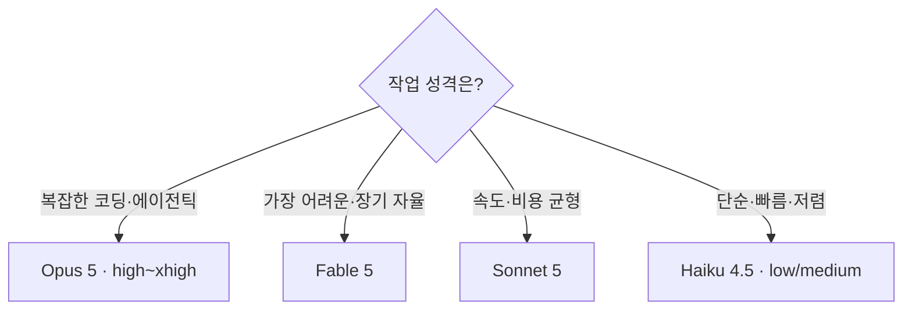

Claude Code는 여러 Claude 모델 위에서 돌아갑니다. **어떤 모델을, 어느 강도로 쓰느냐**가 결과 품질·속도·비용을 좌우합니다. 이 챕터는 현재(2026년) 모델 라인업과, Claude Code에서 이를 통제하는 `/model`·`/effort`·`/fast`를 다룹니다.

## 현재 모델 라인업 (2026)

Claude 5 세대가 핵심입니다. 티어별로 지능·속도·가격이 다릅니다.

| 모델 | ID | 컨텍스트 | 입력/출력 ($/1M) | 성격 |
| --- | --- | --- | --- | --- |
| **Claude Fable 5** | `claude-fable-5` | 1M | $10 / $50 | **최고 지능** — 장기 실행 에이전트, 가장 어려운 작업 |
| **Claude Opus 5** | `claude-opus-5` | 1M | $5 / $25 | **복잡한 에이전틱 코딩·엔터프라이즈**. Anthropic 권장 기본 |
| **Claude Sonnet 5** | `claude-sonnet-5` | 1M | $3 / $15※ | 속도와 지능의 최적 균형 |
| **Claude Haiku 4.5** | `claude-haiku-4-5` | 200K | $1 / $5 | 가장 빠르고 저렴 — 단순·속도 중시 |

<small>※ Sonnet 5는 2026-08-31까지 도입가 $2/$10. Opus 4.8·4.7 등은 레거시(계속 사용 가능하나 마이그레이션 권장).</small>

> **모델 선택의 감:**
> - **복잡한 코딩·에이전틱** → **Opus 5** (다중 파일 기능·대규모 리팩터·엔드투엔드 작업에서 최강, 스텁 없이 끝까지 완성)
> - **가장 어려운·장기 자율 작업** → **Fable 5** (최고 지능 티어)
> - **속도·비용 균형** → **Sonnet 5**
> - **단순·빠름·저렴** → **Haiku 4.5** (분류, 간단 조회, 서브에이전트 저비용 탐색)

Anthropic은 "어떤 모델을 쓸지 모르겠으면 **복잡한 에이전틱 코딩엔 Opus 5부터**, 최고 능력이 필요하면 **Fable 5**"를 권합니다.

---

## 모델 전환 — `/model`

세션 중 `/model`로 모델을 바꾸고 기본값으로 설정합니다.

```text
/model            # 대화형 선택
/model opus       # 별칭으로 바로 지정 (sonnet/opus/haiku/fable)
```

> **서브에이전트는 모델을 따로 지정**할 수 있습니다([7장](#ch7)의 `model` 프론트매터). 읽기 위주 탐색은 `haiku`로 저렴하게, 판단이 중요한 작업은 `opus`/`fable`로 — 리소스를 작업 성격에 맞추는 것이 핵심입니다.

---

## 추론 강도 — `/effort`

Claude 5 세대는 **effort**로 "얼마나 깊이 생각하고 행동할지"를 조절합니다. 단순히 사고량만이 아니라 도구 호출·검증 루프의 적극성까지 좌우합니다.

| 레벨 | 언제 |
| --- | --- |
| `max` | 정확성이 비용보다 훨씬 중요한 극난도 (과사고 위험, 테스트 후 사용) |
| `xhigh` | **어려운 코딩·에이전틱 작업** — 여기로 올려라 |
| `high` | **기본값** (Claude API·Claude Code). 지능·토큰 균형 |
| `medium` | 비용·지연 절감 — 품질이 유지되는 루틴 작업에 적극 활용 |
| `low` | 짧고 범위 명확한, 지연 민감 작업(채팅·단순 조회) |

```text
/effort xhigh
```

> **핵심(2026 최신):** Opus 5·Sonnet 5의 기본 effort는 **`high`**입니다. **기본(high)에서 시작**해 자신의 평가셋으로 조정하세요 — **`low`·`medium`을 비용·속도의 주 레버로 적극 활용**하고(품질이 유지되는 한), **어려운 코딩·에이전틱엔 `xhigh`로 올립니다**. 이전 모델의 effort 기본값을 그대로 가져왔다면 재튜닝하세요.

- **낮은 effort에서 얕은 추론**이 보이면, 프롬프트로 우회하기보다 **effort를 올리는 것**이 먼저입니다.
- **높은 effort + 긴 작업**이면 출력 토큰 여유(`max_tokens`)를 넉넉히 — 사고가 예산의 큰 몫을 쓸 수 있습니다.

> **적응형 사고(adaptive thinking):** Opus 5·Sonnet 5·Fable 5는 언제·얼마나 생각할지 **스스로 정합니다**(고정 "thinking budget" 개념은 폐기). Fable 5는 사고가 **항상 켜져** 있고, effort가 그 깊이를 조절하는 주 레버입니다. 모델별 프롬프트 튜닝은 [14장 최신 모델 프롬프트 가이드](#ch14)에서 자세히 다룹니다.

---

## 빠른 모드 — `/fast`

**Fast 모드**는 최근 Opus 티어를 같은 지능으로 유지하면서 **출력 속도를 최대 2.5배**까지 올립니다(프리미엄 가격, 리서치 프리뷰). 작은 모델로 낮추는 게 아니라 같은 Opus를 더 빠르게 내보냅니다.

```text
/fast     # 토글 — 인터랙티브하게 빠른 피드백이 필요할 때
```

---

## 컨텍스트·비용 함께 보기

- **컨텍스트 창**: Fable 5·Opus 5·Sonnet 5는 **1M 토큰**(기본이자 최대), Haiku 4.5는 200K. 크다고 다 채우라는 뜻은 아닙니다 — 찰수록 성능이 떨어지므로 [자동 압축·`/clear`](#ch2)와 [컨텍스트 엔지니어링](#ch12)으로 관리하세요.
- **비용 통제**: `/usage`로 사용량·비용 확인. 저비용이 필요하면 **effort를 low/medium으로** 내리거나 모델을 낮추고(Sonnet/Haiku), 반복 컨텍스트가 크면 프롬프트 캐싱이 자동으로 절감합니다.
- **모델을 세션 중간에 바꾸면** 프롬프트 캐시가 무효화됩니다 — 잦은 전환보다 작업 성격에 맞춰 초반에 정하는 편이 낫습니다.



---

## 핵심 요약

- 현재 라인업: **Fable 5**(최고 지능) · **Opus 5**(복잡 코딩·에이전틱, Anthropic 권장 기본) · **Sonnet 5**(균형) · **Haiku 4.5**(빠름·저렴). Opus 4.8 등은 레거시.
- **`/model`**로 모델을, **`/effort`**로 추론 강도를 조절 — **기본은 `high`, 어려운 코딩·에이전틱은 `xhigh`, 비용 절감은 `low/medium`**.
- **`/fast`**는 최근 Opus를 최대 2.5배 빠르게(프리미엄). 적응형 사고는 스스로 사고량을 정한다.
- 1M 컨텍스트라도 관리가 필요하고, 모델별 프롬프트 튜닝은 [14장](#ch14)에서 다룬다.
