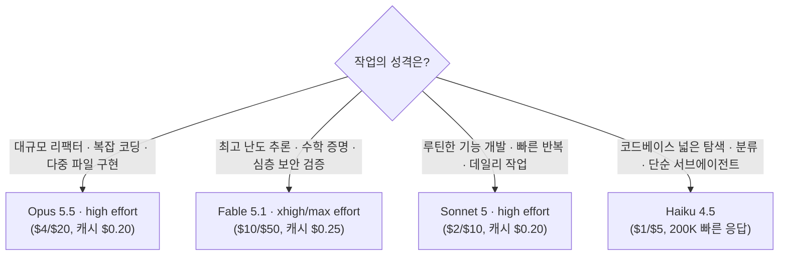

Claude Code는 여러 Claude 모델 위에서 돌아갑니다. **어떤 모델을, 어느 강도로 쓰느냐**가 결과 품질·속도·비용을 좌우합니다. 이 챕터는 최신 모델 라인업(Opus 5.5·Fable 5.1)과, Claude Code에서 이를 통제하는 `/model`·`/effort`·`/fast`, 그리고 안전 가드레일을 다룹니다.

## 현재 모델 라인업 (2026)

Claude 5 세대가 핵심입니다. 티어별로 지능·속도·가격이 다릅니다.

| 모델 | ID | 컨텍스트 | 입력/출력 ($/1M) | 캐시 읽기 ($/1M) | 성격 |
| --- | --- | --- | --- | --- | --- |
| **Claude Opus 5.5** | `claude-opus-5-5` | 1M | $4 / $20 | **$0.20** | **최신 플래그십 코딩·에이전틱** — Opus 5 대비 40% 저렴, 장기 자율 실행, Fable급 보안 가드레일 |
| **Claude Fable 5.1** | `claude-fable-5-1` | 1M | $10 / $50 | **$0.25** | **최고 지능 프런티어** — 가장 복잡한 장기 실행 에이전트·심층 연구 (캐시 읽기 75% 인하) |
| **Claude Opus 5** | `claude-opus-5` | 1M | $5 / $25 | $0.50 | 이전 세대 플래그십 (Opus 5.5로 전환 권장) |
| **Claude Sonnet 5** | `claude-sonnet-5` | 1M | $2 / $10 | $0.20 | 속도와 지능의 최적 균형 (데일리 코딩) |
| **Claude Haiku 4.5** | `claude-haiku-4-5` | 200K | $1 / $5 | $0.10 | 가장 빠름 — 프런티어 근접 지능, 단순 분류·탐색 서브에이전트 |

<small>**Claude Opus 5.5**(2026년 9월 22일 출시)는 기본 입력/출력 단가가 20% 인하($4/$20)되고 캐시 읽기가 60% 인하($0.20)되어, 실무 토큰 과금 기준 **전체 작업 비용이 Opus 5 대비 약 40% 절감**됩니다. 또한 별도의 "생각해라" 지시 없이도 적응형 사고를 수행하며, 긴 세션 자율 실행력과 소통 명확성이 대폭 향상되었습니다.</small>

<small>**Claude Fable 5.1**(2026년 9월 출시)은 최고 지능 티어로, 캐시 읽기 비용을 75% 인하($0.25/M 토큰)하여 수백 회 도구를 호출하는 에이전틱 세션의 부담을 크게 줄였습니다. 동일한 아키텍처이지만 보안 제한을 완화해 신뢰받는 보안·생명과학 연구진에게만 제한 제공되는 자매 모델로 **Claude Mythos 5.1**(Project Glasswing)이 있습니다.</small>

<small>**최대 출력**은 Opus 5.5·Fable 5.1·Opus 5·Sonnet 5가 128K, Haiku 4.5가 64K 토큰입니다. **지식 컷오프**는 Opus 5.5가 2026년 8월, Fable 5.1이 2026년 6월, Opus 5가 2026년 5월, Sonnet 5가 2026년 1월, Haiku 4.5가 2025년 2월입니다 — 그 이후에 나온 라이브러리·API는 모른다고 보고 [웹 검색·문서 MCP](#ch10)로 보완하세요.</small>

> **모델 선택의 실무 가이드:**
> - **복잡한 코딩·대규모 리팩터·장기 에이전틱 작업** → **Opus 5.5** (Anthropic 권장 기본. 높은 디테일 감지, 스텁 없는 완결성, 더 낮은 비용)
> - **최고 난도 추론·수학/하드웨어 증명·극단적 엣지케이스** → **Fable 5.1** (프런티어 지능, 초저가 캐시 읽기)
> - **일상적인 기능 개발·속도와 비용의 균형** → **Sonnet 5**
> - **경량 서브에이전트·단순 분류·초고속 질의응답** → **Haiku 4.5**

---

## 모델 전환 — `/model`

세션 중 `/model`로 모델을 바꾸고 기본값으로 설정합니다.

```text
/model            # 대화형 선택 메뉴
/model opus-5-5   # 별칭 또는 모델명으로 바로 지정 (opus-5-5/fable/sonnet/haiku)
```

> **서브에이전트는 모델을 따로 지정**할 수 있습니다([7장](#ch7)의 `model` 프론트매터). 넓은 코드베이스 탐색은 `haiku`로 저렴하게, 핵심 기능 구현 및 아키텍처 판단은 `opus-5-5`나 `fable`로 지정하여 자원을 최적화하세요.

---

## 추론 강도 — `/effort`

Claude 5 세대(Opus 5.5·Fable 5.1·Opus 5·Sonnet 5)는 **effort**로 "얼마나 많은 연산과 검증을 쏟을지"를 조절합니다. 단순 사고량뿐만 아니라 자율적 도구 호출 횟수, 엣지케이스 점검 루프의 집요함을 좌우합니다.

| 레벨 | 언제 쓰는가 | 실무 특징 |
| --- | --- | --- |
| `max` | 정확성이 비용보다 압도적으로 중요한 극난도 과제 | 자체 퍼저 작성, 소스코드 역추적 등 최대 검증 (긴 런타임 고려) |
| `xhigh` | **숨겨진 엣지케이스가 많은 보안·하드웨어·복잡 알고리즘** | 반사실적 검토, 철저한 테스트 자동 생성 |
| `high` | **기본값 (Default)** — Claude Code & API | 대부분의 실무 코딩에 최적인 지능·속도·비용 균형점 |
| `medium` | 비용과 지연 시간을 줄이면서 준수한 품질 유지 | 루틴한 CRUD 기능 개발, 정형화된 코드 마이그레이션 |
| `low` | 짧고 범위가 명확한 작업, 빠른 프로토타입 구현 | 지연 시간 최소화, 사람과의 빠른 인터랙티브 반복 |

```text
/effort high
```

### 벤치마크 검증: Terminal-Bench 3.0과 Effort 곡선

Anthropic 엔지니어링 팀(Thariq Shihipar)의 실측 결과, Opus 5.5와 Fable 5.1은 effort 설정에 따라 선형에 가까운 뚜렷한 성능 향상 곡선을 보입니다.

| Effort 설정 | Opus 5.5 성공률 | Fable 5.1 성공률 | 핵심 행동 특성 및 리소스 사용 |
| :--- | :---: | :---: | :--- |
| **`low`** | 36.6% | 37.8% | 단일 패스 구현, 최소 도구 호출, 초고속 프로토타이핑 (지연 시간 최소) |
| **`medium`** | 50.1% | 44.5% | 기본 검증 실행, 준수한 루틴 코딩 품질 (비용 절감 효과) |
| **`high`** | **58.9%** | 51.2% | **기본값** — Opus 5.5가 Fable 5.1 max급 성능을 **절반의 토큰**으로 달성 |
| **`xhigh`** | 62.4% | 55.6% | 적대적 자가 검토, 다중 엣지케이스 테스트 스위트 생성 |
| **`max`** | **65.7%** | **58.0%** | 파서 소스코드 분석, 무작위 퍼저(fuzzer) 작성, 극난도 과제 완결 |

- **Opus 5.5의 효율성**: **Opus 5.5의 `high` 레벨(58.9%)은 Fable 5.1의 `max` 레벨(58.0%)과 동급의 성공률을 단 절반의 토큰 소비로 달성**합니다.
- **높은 Effort가 반드시 필요한 순간**: 커뮤니티 벤치마크인 [Terminal-Bench 3.0](https://github.com/harbor-framework/terminal-bench)의 `html-js-filter`(XSS 방어용 정밀 HTML 새니타이저 구현) 과제에서, Fable 5.1은 `low` effort에서 5회 중 1회만 통과(2분 소요)했으나, `xhigh` effort에서는 **5회 모두 완벽 통과(33분 소요)**했습니다. 고난도 effort에서는 모델이 자체 초안을 적대적으로 검토하고, 파서 소스 코드를 읽어 취약점을 찾으며, 무작위 문서 퍼저(fuzzer)를 직접 작성해 검증합니다.
- **추천 개발 루프 (Feature Engineering Loop)**:
  1. **요구사항 인터뷰**: Claude에게 명세를 주고 질문을 유도 (`AskUserQuestion` 등)
  2. **`low` effort 구현**: 저비용·초고속으로 핵심 뼈대 작성
  3. **`low` effort 검토 및 반복**: 사람이 방향성을 확인하며 빠르게 피드백
  4. **`high` 또는 `xhigh` effort 검증**: 회귀 테스트, 엣지케이스 검증, 보안 리뷰

> **effort 동작 특성 요약:**
> - **effort 지원 모델**: Opus 5.5·Fable 5.1·Opus 5·Sonnet 5. (Haiku 4.5는 적응형 사고 미지원, 구세대 `budget_tokens` 방식만 지원)
> - **적응형 사고 상시 활성화**: Opus 5.5와 Fable 5.1은 매 응답 전 스스로 생각하며, 사고 기능을 끌 수 없습니다. 프롬프트에 불필요하게 "think hard", "think step by step"을 넣지 마세요.
> - **답변 길이 레버가 아님**: effort를 낮춘다고 답변 텍스트가 짧아지지 않습니다. 출력 길이는 [14장](#ch14)의 프롬프트 지침으로 제어해야 합니다.

---

## 빠른 모드 — `/fast`

**Fast 모드**는 지능 손실 없이 Opus의 **출력 속도를 최대 2.5배**까지 가속합니다(리서치 프리뷰). 대화형으로 빠르게 질문을 주고받아야 하는 페어 프로그래밍 환경에 유용합니다.

```text
/fast     # 토글 (Fast mode ON / OFF)
```

- **지원 모델**: **Opus 5.5** 및 Opus 5. (Sonnet·Haiku에서는 지원되지 않으며 실행 시 자동으로 꺼짐)
- **비용 주의사항**:
  - fast 모드는 출력 속도를 높이는 대신 **토큰당 단가가 2배**로 책정됩니다.
  - **구독 플랜(Pro·Max·Team)에 기본 포함되지 않으며**, 플랜 한도가 남아 있더라도 **추가 사용량 크레딧에서 차감**됩니다.
  - 세션 중간에 켜면 해당 시점의 컨텍스트를 fast 미캐시 입력가로 1회 재청구하므로, 쓸 거라면 **세션 시작 직후** 켜는 것이 비용상 유리합니다.

---

## 보안 가드레일과 플래그 대응 (Safeguards & Flags)

Opus 5.5는 Opus 계열 최초로 **Fable 수준의 첨단 생물학·사이버보안 가드레일**이 적용되었습니다. 엔터프라이즈 환경에서 안전한 코드 작성을 보장하기 위한 메커니즘입니다.

### 메시지 플래그(Flag) 시 동작 원리
코드 내 보안 취약점을 탐지하고 수정하는 정당한 개발 작업은 전면 허용되지만, 악성 코드 패턴이나 위험 페이로드 분석 시 가드레일이 트리거될 수 있습니다.
1. **자동 모델 스위칭 (Fallback)**: Claude apps와 Claude Code에서는 메시지가 플래그되면 작업이 즉시 중단되는 대신 **이전 세대 안전 모델로 세션이 자동 전환**되어 흐름을 이어갑니다.
2. **복구 및 제어**:
   - 원래 모델로 복귀하려면 `/model opus-5-5`를 입력합니다.
   - 직전 프롬프트가 원인이라면 **`Esc`를 두 번 눌러 직전 입력을 수정**하고 재시도합니다.
   - 자동 스위칭 대신 확인 창을 띄우고 싶다면 `/config`에서 `Switch models when a message is flagged` 설정을 변경합니다.
   - 정상적인 개발 작업이 오탐(False Positive)되었다면 `/feedback` 명령으로 리포트합니다.

> ⚠️ **보안 주의사항 — 내부 사고 과정(Internal Reasoning) 출력 요구 금지:**
> 프롬프트에 "생각한 내부 과정을 그대로 보여달라"거나 숨겨진 추론 태그를 추출하려는 시도는 보안 정책상 **단호히 거부(Decline)**되며 플래그 사유가 됩니다. 추론 과정이 궁금하다면 *"왜 이 방식을 선택했는지 3문장으로 설명해 달라"*와 같이 명시적 설명 형식으로 요청하세요.

---

## `/advisor` — 결정 지점에서만 상위 모델 자문 구하기

세션 내내 최고가 모델을 쓰는 것은 비용 낭비일 수 있습니다. `/advisor`는 평소에는 Sonnet 5 등 가벼운 모델로 작업하다가, **설계 결정이나 복잡한 디버깅 순간에만 상위 모델(Opus 5.5 또는 Fable 5.1)의 자문을 구하는** 기능입니다.

```bash
/advisor              # 세션 중 어드바이저 대화형 지정
claude --advisor opus-5-5 # 세션 시작 시 지정
```

- **호출 시점**: Claude가 전체 대화 맥락과 도구 결과를 바탕으로 자문이 필요한 순간을 자율적으로 판단합니다.
- **제약**: 어드바이저는 메인 모델보다 지능이 낮을 수 없습니다. Sonnet 5 메인은 Opus 5.5/Fable 5.1을 어드바이저로 쓸 수 있지만, Opus 5.5 메인에 Sonnet을 붙일 수는 없습니다.

---

## 컨텍스트·비용 종합 의사결정


```mermaid
flowchart TD
    Q{"작업의 성격은?"}
    Q -->|"대규모 리팩터 · 복잡 코딩 · 다중 파일 구현"| O["Opus 5.5 · high effort<br/>($4/$20, 캐시 $0.20)"]
    Q -->|"최고 난도 추론 · 수학 증명 · 심층 보안 검증"| F["Fable 5.1 · xhigh/max effort<br/>($10/$50, 캐시 $0.25)"]
    Q -->|"루틴한 기능 개발 · 빠른 반복 · 데일리 작업"| S["Sonnet 5 · high effort<br/>($2/$10, 캐시 $0.20)"]
    Q -->|"코드베이스 넓은 탐색 · 분류 · 단순 서브에이전트"| H["Haiku 4.5<br/>($1/$5, 200K 빠른 응답)"]
```

- **토크나이저 차이 인지**: Opus 5.5·Fable 5.1·Sonnet 5는 구세대 모델 대비 동일 텍스트에서 토큰 수가 약 30% 증가합니다.
- **프롬프트 캐싱 극대화**: 긴 파일과 시스템 프롬프트를 재사용하는 에이전틱 작업에서는 캐시 읽기 단가가 핵심입니다. Opus 5.5($0.20)와 Fable 5.1($0.25) 모두 캐시 읽기 비용이 대폭 인하되어 장기 세션 총비용이 매우 저렴합니다.

---

## 핵심 요약

- **2026 라인업의 중심**: **Opus 5.5**(권장 기본 플래그십, $4/$20, 이전 대비 40% 비용 절감)와 **Fable 5.1**(최고 지능 프런티어, 캐시 읽기 $0.25).
- **추론 강도 제어 (`/effort`)**:
  - 기본은 `high`.
  - **Opus 5.5 high(58.9%)는 Fable 5.1 max(58.0%)와 동급 성능을 절반 토큰으로 제공**.
  - XSS 새니타이저 등 엣지케이스가 숨겨진 고위험 작업에는 `xhigh`/`max`로 적대적 자가 검증 유도.
- **실무 4단계 루프**: 인터뷰 → `low` effort 프로토타입 → `low` 반복 → `high/xhigh` 검증 및 보안 감사.
- **빠른 모드 (`/fast`)**: Opus 5.5·Opus 5에서 최대 2.5배 가속. (비용 2배, 추가 크레딧 차감 유의)
- **보안 가드레일**: 메시지 플래그 시 이전 안전 모델로 자동 폴백. 내부 사고 출력 요구는 정책 위반이므로 명시적 설명 지시문으로 대체할 것.
