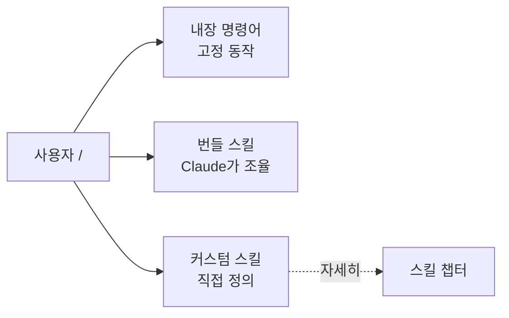

Claude Code는 자연어로 대화하는 도구지만, **자주 하는 작업일수록 매번 문장으로 설명하는 건 비효율적**입니다. 슬래시 커맨드(slash command)는 `/`로 시작하는 짧은 명령으로, 정해진 동작을 **일관되게, 예측 가능하게** 실행하는 진입점입니다.

카페에서 "아메리카노 주세요"라고 하면 늘 같은 레시피로 나오는 것처럼, `/deploy`를 입력하면 늘 같은 절차가 실행됩니다. "커피 한 잔 주세요"처럼 모호하게 말했을 때와 결과가 달라지는 것을 막아 주는 것이 명령어의 핵심 가치입니다.

> **2026년 중요 변경점**: 예전의 커스텀 명령어(`.claude/commands/`)는 **스킬(Skill)으로 통합**되었습니다. `.claude/commands/deploy.md`와 `.claude/skills/deploy/SKILL.md`는 둘 다 `/deploy`를 만들고 동일하게 동작합니다. 기존 `.claude/commands/` 파일은 그대로 작동하지만, 새로 만들 때는 [스킬](#ch8)을 권장합니다. 이 챕터는 **내장 명령어**와 **명령의 기본 문법**을 다루고, 커스텀 명령 제작은 스킬 챕터에서 자세히 다룹니다.

---

## 명령의 세 가지 종류

`/`를 입력했을 때 뜨는 목록에는 성격이 다른 세 부류가 섞여 있습니다.

| 종류 | 예시 | 설명 |
| --- | --- | --- |
| **내장 명령어(Built-in)** | `/clear`, `/compact`, `/model` | Claude Code에 고정 로직으로 내장. 항상 사용 가능 |
| **번들 스킬(Bundled skill)** | `/code-review`, `/security-review`, `/loop` | 프롬프트 기반으로 Claude가 도구를 써서 처리 |
| **커스텀 스킬/명령** | `/deploy`, `/fix-issue` | 사용자가 직접 정의 ([스킬 챕터](#ch8)) |

내장 명령어는 대부분 즉시 실행되는 고정 동작이고, 번들 스킬은 Claude에게 상세 지시를 주고 스스로 작업을 조율하게 합니다.

---

## 자주 쓰는 내장 명령어

전체 목록은 세션에서 `/help`로 볼 수 있습니다. 실무에서 가장 자주 손이 가는 것들만 추려 봅니다.

### 세션·컨텍스트 관리 (가장 중요)

| 명령어 | 하는 일 |
| --- | --- |
| `/clear` | 컨텍스트를 완전히 리셋. **작업이 바뀔 때마다 습관적으로** 사용 |
| `/compact [지시]` | 대화를 요약해 컨텍스트 공간 확보. `/compact API 변경에 집중`처럼 힌트 가능 |
| `/context` | 컨텍스트 사용량을 시각화하고 최적화 제안 |
| `/rewind` | 코드·대화를 이전 체크포인트로 되돌리기 (`Esc` 두 번과 동일) |
| `/resume`, `/continue` | 이전 대화 이어가기 |

> 컨텍스트 창은 Claude Code에서 **가장 중요한 자원**입니다. 창이 찰수록 성능이 떨어지고 앞선 지시를 "잊기" 시작합니다. `/clear`와 `/compact`를 아끼지 말고 쓰세요.

### 모델·성능

| 명령어 | 하는 일 |
| --- | --- |
| `/model` | 모델 전환 및 기본값 설정 |
| `/effort` | 추론 강도 설정 (`low`/`medium`/`high`/`xhigh`/`max`) |
| `/fast` | 빠른 모드 토글 (Opus의 출력 속도를 높임, 모델을 낮추지 않음) |

### 설정·프로젝트

| 명령어 | 하는 일 |
| --- | --- |
| `/init` | 코드베이스를 분석해 시작용 `CLAUDE.md` 생성 |
| `/memory` | `CLAUDE.md` 편집, 자동 기억 관리 |
| `/permissions` | 도구·명령 승인 규칙 설정 |
| `/config` | 설정 열기 또는 키-값 설정 |
| `/hooks` | 구성된 훅을 이벤트별로 열람(읽기 전용) |
| `/mcp` | MCP 서버 연결·OAuth 관리 |
| `/agents` | 서브에이전트 관리 |

### 진단·품질

| 명령어 | 하는 일 |
| --- | --- |
| `/doctor` | 셋업 점검, 문제 진단·수정 제안 |
| `/status` | 현재 세션 상태 확인 |
| `/usage` | API 사용량·비용 표시 |
| `/code-review` | 변경 diff를 새 서브에이전트가 검토(번들 스킬, `--fix`로 수정 적용) |
| `/security-review` | diff의 보안 취약점 점검(번들 스킬) |
| `/code-review ultra` | 같은 리뷰를 **클라우드에서 다중 에이전트로** 깊게(지적마다 재현·검증). 사용량 크레딧 과금 — [16장](#ch16) |
| `/advisor` | 결정 지점에 물어볼 **더 강한 모델** 지정([3장](#ch3)) |
| `/btw` | 히스토리에 남기지 않고 빠른 곁가지 질문 |

---

## 명령 문법: 인자·셸·파일 참조

커스텀 명령(스킬 포함)에서 쓰이는 핵심 문법 3가지는 그대로 알아 두면 유용합니다.

### 1) 인자 전달

`$ARGUMENTS`는 명령 뒤에 붙인 전체 텍스트로, `$0`·`$1`은 위치별 인자로 치환됩니다.

```markdown
Fix GitHub issue $ARGUMENTS following our coding standards.
```

`/fix-issue 123`으로 실행하면 `$ARGUMENTS`가 `123`으로 바뀝니다. 위치 인자는 셸식 따옴표 규칙을 따릅니다 — `/migrate "hello world" Vue`에서 `$0`은 `hello world`, `$1`은 `Vue`.

### 2) 셸 명령 주입 (동적 컨텍스트)

`` !`명령` `` 는 **Claude가 내용을 보기 전에** 셸에서 먼저 실행되어, 그 출력이 자리표시자를 대체합니다. 실시간 데이터를 프롬프트에 그대로 넣을 수 있습니다.

```markdown
## 현재 변경사항
!`git diff HEAD`

## 지시
위 변경을 3줄로 요약하고 위험 요소를 나열하라.
```

`!`는 줄 맨 앞이나 공백 뒤에 올 때만 인식됩니다. 여러 줄은 ` ```! ` 펜스 블록을 씁니다.

### 3) 파일 참조

`@경로`로 파일을 참조하면 Claude가 응답 전에 그 파일을 읽습니다. 프롬프트에서 "어디에 코드가 있는지" 설명하는 대신 `@src/auth/session.ts`처럼 직접 가리키세요.

---

## 실전 팁

- **모호함을 줄이는 도구로 명령을 쓰세요.** 반복 작업일수록 명령으로 고정하면 결과 편차가 사라집니다.
- **`/clear`는 성능 관리 도구**입니다. 같은 이슈로 두 번 이상 교정했다면 컨텍스트가 실패한 시도로 오염된 상태 — `/clear` 후 더 구체적인 프롬프트로 다시 시작하는 편이 거의 항상 낫습니다.
- **번들 스킬 끄기**: `disableBundledSkills` 설정으로 `/doctor`를 제외한 번들 스킬을 모두 끌 수 있습니다.
- **명령이 안 보일 때**: 세션 시작 후 새로 만든 디렉터리는 감지되지 않을 수 있습니다. Claude Code를 재시작하세요.

---

## 핵심 요약



- 슬래시 커맨드는 **일관성**을 주는 진입점이다.
- 커스텀 명령어는 이제 **스킬로 통합**됐다 — 기존 `.claude/commands/`도 계속 작동한다.
- `$ARGUMENTS`(인자), `` !`cmd` ``(셸 주입), `@file`(파일 참조)이 세 가지 문법의 핵심이다.
- `/clear`·`/compact`·`/context`로 컨텍스트를 능동적으로 관리하는 습관이 성능을 좌우한다.
