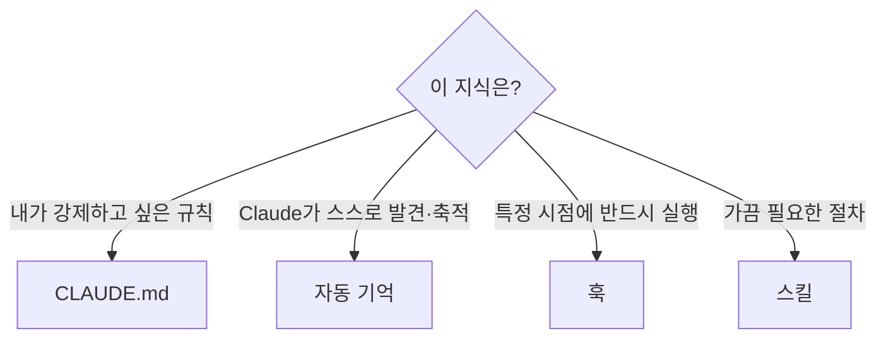

[CLAUDE.md](#ch5)가 **당신이 직접 쓰는** 지침이라면, **자동 기억(Auto memory)**은 **Claude가 스스로 쓰는** 노트입니다. 당신이 아무것도 적지 않아도 Claude가 작업하며 알게 된 것 — 빌드 명령, 디버깅 통찰, 아키텍처 노트, 코드 스타일 선호, 워크플로 습관 — 을 저장해 세션을 넘어 축적합니다.

Claude Code에는 세션 간 지식을 잇는 **두 가지 보완적 메커니즘**이 있습니다.

| | CLAUDE.md | 자동 기억 |
| --- | --- | --- |
| **누가 씀** | 당신 | Claude |
| **담는 것** | 지침·규칙 | 학습·패턴 |
| **스코프** | 프로젝트·사용자·조직 | 저장소별(워크트리 간 공유) |
| **로드** | 매 세션 전체 | 매 세션(`MEMORY.md` 앞 200줄/25KB) |
| **쓰임새** | 코딩 표준·워크플로·아키텍처 | 빌드 명령·디버깅 통찰·발견한 선호 |

CLAUDE.md는 행동을 **안내**할 때, 자동 기억은 Claude가 당신의 **교정으로부터 스스로 학습**하게 하고 싶을 때 씁니다. 둘 다 강제 설정이 아니라 컨텍스트이며, 반드시 막아야 하는 동작은 [PreToolUse 훅](#ch9)을 쓰세요.

---

## 어떻게 작동하나

Claude는 매 세션 무언가를 저장하지는 않습니다. **미래 대화에 유용할지**를 스스로 판단해 저장할 가치가 있는 것만 기록합니다. 인터페이스에 "Saved 2 memories" 또는 "Recalled 2 memories"가 뜨면 Claude가 기억 디렉터리를 갱신·조회하는 중입니다.

당신이 "항상 npm 말고 pnpm 써", "API 테스트는 로컬 Redis가 필요해" 같은 걸 알려 주면 Claude는 이를 자동 기억에 저장합니다. CLAUDE.md에 넣고 싶다면 "이거 CLAUDE.md에 추가해줘"라고 명시하세요.

---

## 저장 위치와 구조

프로젝트마다 고유한 기억 디렉터리를 가집니다.

```text
~/.claude/projects/<project>/memory/
├── MEMORY.md          # 간결한 색인 — 매 세션 로드
├── debugging.md       # 디버깅 패턴 상세
├── api-conventions.md # API 설계 결정
└── ...                # Claude가 만드는 주제 파일들
```

- `<project>`는 **git 저장소에서 유도**되므로, 같은 저장소의 모든 워크트리·하위 디렉터리가 하나의 기억 디렉터리를 공유합니다.
- `MEMORY.md`는 **색인** 역할 — 매 세션 시작 시 **앞 200줄 또는 25KB(먼저 도달하는 쪽)**만 로드됩니다.
- `debugging.md` 같은 주제 파일은 시작 시 로드되지 않고, Claude가 필요할 때 읽습니다.
- **머신 로컬**입니다 — 머신·클라우드 간 공유되지 않습니다.

> **색인 한도 관리**: `MEMORY.md`가 200줄/25KB 한도에 가까워지면 Claude Code가 "한 항목당 한 줄로, 상세는 주제 파일로, 오래된 항목은 병합·삭제하라"고 상기시킵니다. 한도를 넘으면 쓰기는 성공하지만 초과분은 다음 로드에서 버려지므로, 색인을 다시 쓰라는 에러를 반환합니다. YAML 프론트매터와 HTML 주석은 한도 계산에서 제외됩니다.

---

## 켜고 끄기

자동 기억은 **기본 켜짐**입니다.

- 세션에서 `/memory`를 열어 토글(사용자 설정 `~/.claude/settings.json`의 `autoMemoryEnabled`에 저장).
- 특정 프로젝트만 끄려면 그 프로젝트 설정에:

```json
{
  "autoMemoryEnabled": false
}
```

- 환경변수로 끄기: `CLAUDE_CODE_DISABLE_AUTO_MEMORY=1`.
- 저장 위치 변경: `settings.json`의 `autoMemoryDirectory`(절대경로 또는 `~/`로 시작).

기억 파일은 편집·삭제할 수 있는 **평범한 마크다운**입니다. `/memory`로 브라우징하고, 실제로 로드된 것은 `/context`로 확인하세요.

---

## 서브에이전트 기억

[서브에이전트](#ch7)도 자신만의 자동 기억을 가질 수 있습니다. `memory` 프론트매터로 켜면, 서브에이전트가 코드베이스 패턴·디버깅 통찰·아키텍처 결정을 시간에 걸쳐 축적합니다.

```markdown
---
name: code-reviewer
description: 코드 품질과 모범 사례 검토
memory: project
---

당신은 코드 리뷰어입니다. 리뷰하며 발견한 패턴·관례·반복되는 이슈를
당신의 에이전트 기억에 갱신하세요.
```

| 스코프 | 위치 | 언제 |
| --- | --- | --- |
| `user` | `~/.claude/agent-memory/<name>/` | 모든 프로젝트에 걸쳐 기억 |
| `project` | `.claude/agent-memory/<name>/` | 프로젝트 특화, 버전 관리로 공유(**권장 기본값**) |
| `local` | `.claude/agent-memory-local/<name>/` | 프로젝트 특화, 커밋하지 않음 |

메인 대화의 자동 기억은 서브에이전트에 로드되지 않으며, 서브에이전트 기억은 **별도 디렉터리**입니다. 자동 기억을 끄면 `memory` 필드도 무효화됩니다.

**활용 팁**:
- 시작 전에 기억을 참고하게: "이 PR을 리뷰하되, 전에 본 패턴이 기억에 있는지 확인해."
- 완료 후 갱신하게: "끝났으니 배운 걸 기억에 저장해."
- 서브에이전트 본문에 자기 기억을 능동적으로 관리하라는 지시를 직접 넣으면, 대화를 넘어 제도적 지식이 쌓입니다.

---

## CLAUDE.md인가 자동 기억인가 — 선택 기준



- **내가 항상 지키게 하고 싶다** → CLAUDE.md
- **Claude가 교정·발견으로 스스로 배우게 하고 싶다** → 자동 기억
- **반드시 특정 시점에 실행돼야 한다** → [훅](#ch9)
- **가끔만 필요한 절차·지식이다** → [스킬](#ch8)

---

## 핵심 요약

- 자동 기억은 **Claude가 스스로 쓰는** 노트 — 당신의 교정·선호로부터 세션을 넘어 학습한다.
- `~/.claude/projects/<project>/memory/`에 저장되고, `MEMORY.md`(앞 200줄/25KB)가 색인으로 매 세션 로드된다.
- 기본 켜짐, `/memory`나 `autoMemoryEnabled`로 통제. 모두 편집 가능한 마크다운.
- 서브에이전트도 `memory` 스코프(`project` 권장)로 자기 지식을 축적할 수 있다.
