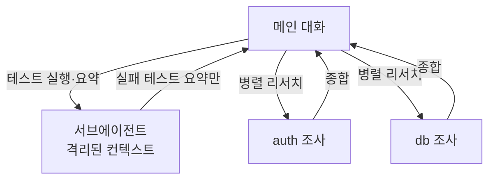

서브에이전트(subagent)는 **특정 작업을 전담하는 별도의 AI 도우미**입니다. 각자 **독립된 컨텍스트 창**, 고유한 시스템 프롬프트, 제한된 도구 접근, 별도 권한을 가집니다.

핵심 가치는 **컨텍스트 보호**입니다. 테스트를 돌리거나 코드베이스를 뒤지면 수만 토큰의 출력이 쏟아지는데, 이걸 메인 대화에 쌓으면 성능이 떨어집니다. 서브에이전트에게 맡기면 그 장황한 출력은 **서브에이전트의 컨텍스트에만 남고, 요약만 메인으로 돌아옵니다.**

서브에이전트가 주는 이점:
- **컨텍스트 보존** — 탐색·구현을 메인 대화 밖으로
- **제약 강제** — 쓸 수 있는 도구를 제한
- **재사용** — 사용자 레벨 정의로 프로젝트 간 공유
- **전문화** — 도메인 특화 시스템 프롬프트
- **비용 절감** — Haiku 같은 빠르고 저렴한 모델로 라우팅

---

## 내장 서브에이전트

Claude가 상황에 맞게 자동으로 쓰는 내장 에이전트가 있습니다.

| 에이전트 | 모델 | 도구 | 용도 |
| --- | --- | --- | --- |
| **Explore** | 메인 상속(API에선 Opus 상한) | 읽기 전용(Write·Edit 거부) | 파일 검색·코드베이스 탐색 |
| **Plan** | 메인 상속 | 읽기 전용 | 플랜 모드에서 계획 전 리서치 |
| **general-purpose** | 메인 상속 | 서브에이전트 가용 도구 전체 | 탐색+수정이 필요한 복합 작업 |

Explore와 Plan은 **CLAUDE.md와 git 상태를 건너뛰어** 리서치를 가볍고 빠르게 유지합니다. 나머지 모든 에이전트는 둘 다 로드합니다.

---

## 첫 서브에이전트 만들기

서브에이전트는 **YAML 프론트매터 + 마크다운 본문(시스템 프롬프트)** 형식의 파일입니다. Claude에게 만들어 달라고 하거나 직접 작성합니다.

```markdown
---
name: code-reviewer
description: 코드 품질과 모범 사례를 검토. 코드 작성·수정 후 사용.
tools: Read, Grep, Glob
model: sonnet
---

당신은 코드 리뷰어입니다. 호출되면 코드를 분석해
품질·보안·모범 사례에 대한 구체적이고 실행 가능한 피드백을 제공하세요.
```

본문은 **시스템 프롬프트**가 됩니다. 서브에이전트는 이 프롬프트와 작업 디렉터리 같은 기본 환경 정보만 받고, Claude Code의 전체 시스템 프롬프트는 받지 않습니다.

> `/agents` 명령은 이제 마법사를 열지 않고, "Claude에게 부탁하거나 `.claude/agents/`를 직접 편집하라"는 안내를 출력합니다. Claude Code는 `.claude/agents/`와 `~/.claude/agents/`를 감시하므로, 파일을 추가·수정하면 몇 초 내 다음 위임부터 반영됩니다(새 디렉터리를 처음 만든 경우만 재시작 필요).

---

## 어디에 두는가 — 스코프와 우선순위

| 위치 | 스코프 | 우선순위 |
| --- | --- | --- |
| 관리 설정 | 조직 전체 | 1 (최고) |
| `--agents` CLI 플래그 | 현재 세션 | 2 |
| `.claude/agents/` | 현재 프로젝트 | 3 |
| `~/.claude/agents/` | 모든 프로젝트 | 4 |
| 플러그인 `agents/` | 플러그인 활성 시 | 5 (최저) |

같은 `name`이 여러 곳에 있으면 우선순위 높은 쪽이 이깁니다. 정체성은 **오직 `name` 프론트매터**로 결정되므로(파일명·하위폴더 무관), 트리 전체에서 `name`을 고유하게 유지하세요.

---

## 프론트매터 필드

`name`과 `description`만 필수입니다.

| 필드 | 설명 |
| --- | --- |
| `name` | 소문자·하이픈 식별자(필수) |
| `description` | **언제 위임할지**(필수). 자동 위임의 트리거 |
| `tools` | 허용 도구 목록. 생략 시 서브에이전트 가용 도구 전체 상속 |
| `disallowedTools` | 제거할 도구(denylist) |
| `model` | `sonnet`/`opus`/`haiku`/`fable`/전체 ID/`inherit`. 기본 `inherit` |
| `permissionMode` | `default`/`acceptEdits`/`auto`/`dontAsk`/`bypassPermissions`/`plan` |
| `skills` | 시작 시 컨텍스트에 **프리로드**할 스킬(설명이 아닌 전체 내용 주입) |
| `mcpServers` | 이 서브에이전트에만 줄 MCP 서버 |
| `hooks` | 이 서브에이전트 생명주기에 한정된 훅 |
| `memory` | 지속 기억 스코프: `user`/`project`/`local` ([자동 기억](#ch6) 참고) |
| `isolation` | `worktree` 설정 시 격리된 git 워크트리에서 실행 |
| `background` | `true`면 항상 백그라운드 실행 |

### 도구 제한 (allowlist / denylist)

```markdown
---
name: safe-researcher
description: 제한된 권한의 리서치 에이전트
tools: Read, Grep, Glob, Bash
---
```

위는 4개 도구만 허용 — 파일 수정·쓰기·MCP 사용 불가. 반대로 `disallowedTools: Write, Edit`는 나머지는 상속하되 쓰기만 막습니다. 둘 다 설정하면 `disallowedTools`를 먼저 적용한 뒤 `tools`를 해석합니다.

### 모델 선택으로 비용 관리

읽기 위주의 단순 탐색은 `model: haiku`로 저렴하게, 보안 리뷰처럼 판단이 중요한 작업은 `model: opus`로. 리소스를 작업 성격에 맞추는 것이 핵심입니다.

---

## 자동 위임 vs 명시적 호출

**자동 위임**: Claude는 요청 내용과 각 서브에이전트의 `description`을 보고 스스로 위임합니다. 적극적 위임을 유도하려면 description에 "use proactively" 같은 표현을 넣으세요.

**명시적 호출** — 세 단계로 강해집니다.

```text
# 1) 자연어: Claude가 위임 여부 판단
test-runner 서브에이전트로 실패한 테스트를 고쳐줘

# 2) @멘션: 해당 서브에이전트 실행을 보장
@"code-reviewer (agent)" 인증 변경을 봐줘
```

```bash
# 3) 세션 전체를 한 에이전트로 실행
claude --agent code-reviewer
```

`.claude/settings.json`에 `"agent": "code-reviewer"`를 넣으면 프로젝트 기본값이 됩니다.

---

## 포그라운드 vs 백그라운드

- **포그라운드**: 완료까지 메인 대화를 막음. 권한 프롬프트를 즉시 전달.
- **백그라운드**(기본값): 동시 실행되며 계속 작업 가능. 결과는 완료 시 알림으로 도착. 권한 프롬프트는 메인 세션에 표시되며, 서브에이전트 이름이 함께 뜹니다.

`Ctrl+B`로 실행 중 작업을 백그라운드로 보낼 수 있습니다. 백그라운드 서브에이전트는 **더 좁은 내장 도구 세트**로 동작합니다.

---

## 실전 패턴



- **고출력 작업 격리**: "서브에이전트로 테스트를 돌리고 **실패한 테스트와 에러만** 보고해줘"
- **병렬 리서치**: "auth·database·API 모듈을 별도 서브에이전트로 병렬 조사해줘"
- **체이닝**: "code-reviewer로 성능 이슈를 찾은 다음, optimizer로 고쳐줘"
- **적대적 리뷰(adversarial review)**: 구현이 끝나면 **새 컨텍스트의 리뷰어**가 diff만 보고 검증하게 하라 — 작업한 모델이 스스로 채점하지 않게. 단, 리뷰어에게는 "**정확성·요구사항에 영향을 주는 결함만** 지적하라"고 못박아 과잉 엔지니어링을 막으세요.

> **보안**: Claude Code v2.1.210+는 서브에이전트의 최종 보고를 Claude가 읽기 전에 스캔합니다. 서브에이전트가 읽은 파일·웹페이지에 메인 대화를 노리는 지시가 숨어 있을 수 있기 때문입니다. 그래도 근본 방어는 **서브에이전트가 접근할 수 있는 것을 제한**하는 것(`tools`/`permissionMode`)입니다.

---

## 핵심 요약

- 서브에이전트 = **독립 컨텍스트 + 전용 프롬프트 + 제한된 도구**. 컨텍스트를 지키는 가장 강력한 수단.
- `.claude/agents/`(프로젝트) 또는 `~/.claude/agents/`(개인)에 `name`+`description` 프론트매터로 정의.
- `description`이 자동 위임을 좌우한다. `tools`/`model`로 권한과 비용을 조절한다.
- 고출력 격리·병렬 리서치·적대적 리뷰가 대표 패턴이다. 스킬을 [`skills` 필드로 프리로드](#ch8)해 결합할 수 있다.
