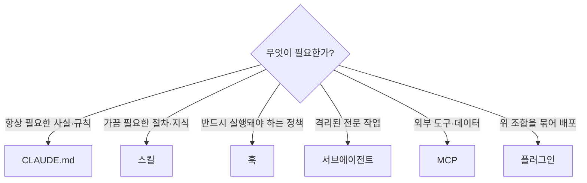

지금까지 배운 [명령어](#ch4)·[CLAUDE.md](#ch5)·[서브에이전트](#ch7)·[스킬](#ch8)·[훅](#ch9)은 모두 Claude Code **안쪽**의 확장입니다. 이 챕터는 바깥으로 확장하는 두 가지 — **MCP(외부 도구 연결)**와 **플러그인(확장 묶음 배포)** — 을 다룹니다.

## MCP — 외부 도구·데이터 연결

**MCP(Model Context Protocol)**는 AI-도구 통합을 위한 오픈 표준입니다. MCP 서버를 연결하면 Claude Code가 당신의 **도구·데이터베이스·API**에 직접 접근합니다.

**언제 연결하나?** 이슈 트래커나 모니터링 대시보드 같은 다른 도구에서 채팅으로 **데이터를 복사해 붙여넣고 있다면** 신호입니다. 연결하면 붙여넣는 대신 Claude가 그 시스템을 직접 읽고 다룹니다.

MCP로 할 수 있는 일 예시:
- "JIRA 이슈 ENG-4521에 설명된 기능을 구현하고 GitHub에 PR을 만들어줘"
- "PostgreSQL에서 이 기능을 쓴 사용자 10명의 이메일을 찾아줘"
- "Slack에 올라온 새 Figma 디자인으로 이메일 템플릿을 갱신해줘"

### 서버 추가 — `claude mcp add`

세 가지 전송 방식이 있습니다.

```bash
# 1) 원격 HTTP 서버 (가장 흔함, OAuth 지원)
claude mcp add --transport http notion https://mcp.notion.com/mcp

# 2) 원격 SSE 서버
claude mcp add --transport sse asana https://mcp.asana.com/sse

# 3) 로컬 stdio 서버 (내 머신에서 프로세스로 실행)
claude mcp add --env AIRTABLE_API_KEY=YOUR_KEY airtable -- npx -y airtable-mcp-server
```

stdio 서버는 **`--`(더블 대시)** 뒤에 실행할 명령을 씁니다 — `--` 뒤는 서버에 그대로 전달됩니다.

### 스코프 — 어디에 저장할지

`-s`/`--scope`로 설정 저장 위치를 정합니다.

| 스코프 | 저장 위치 | 공유 |
| --- | --- | --- |
| `local` (기본) | `~/.claude.json` | 나만, 이 프로젝트 |
| `project` | `.mcp.json` (커밋) | 팀 전체 |
| `user` | `~/.claude.json` | 나의 모든 프로젝트 |

```bash
claude mcp add --scope project --transport http github https://api.githubcopilot.com/mcp/
```

프로젝트 스코프 서버(`.mcp.json`)는 저장소를 신뢰하기 전까지 **승인 대기** 상태입니다 — `claude`를 실행해 검토·승인하세요.

### 관리 — `/mcp`

세션에서 **`/mcp`**로 서버 연결 상태를 보고 **OAuth 인증**을 처리합니다. HTTP/SSE 서버가 끊기면 지수 백오프로 자동 재연결(최대 5회)합니다.

> **보안:** MCP 서버는 외부 코드입니다. 신뢰할 수 있는 서버만 연결하고, 프로젝트 `.mcp.json`은 저장소 신뢰 후에만 활성화하세요. [Anthropic 디렉터리](https://claude.ai/directory)에서 검증된 커넥터를 찾을 수 있습니다.

### CLI 도구도 잊지 마세요

MCP만이 외부 연동은 아닙니다. `gh`(GitHub), `aws`, `gcloud` 같은 **CLI 도구는 가장 컨텍스트 효율적인** 외부 서비스 접근법입니다. `gh`를 설치하면 Claude가 이슈·PR·코멘트를 알아서 다룹니다. Claude는 모르는 CLI도 배웁니다 — `'foo --help'로 foo를 익힌 뒤 A를 해줘`.

---

## 플러그인 — 확장을 묶어 배포

**플러그인**은 [스킬·훅·서브에이전트·MCP 서버](#ch11)를 **하나의 설치 단위**로 묶습니다. 커뮤니티와 Anthropic이 만든 것을 설정 없이 설치할 수 있습니다.

```text
/plugin      # 마켓플레이스 브라우징·설치
```

- 타입 언어를 쓴다면 **코드 인텔리전스 플러그인**을 설치해 정확한 심볼 내비게이션과 편집 후 자동 에러 감지를 얻으세요.
- 플러그인은 스킬·훅·에이전트·MCP를 한 번에 제공하므로, 팀 표준 워크플로를 배포하는 데 이상적입니다.
- 플러그인 마켓플레이스 추가: `/plugin marketplace add <owner/repo>`.

플러그인이 제공하는 스킬·에이전트는 **`plugin-name:skill-name`** 형태의 네임스페이스를 써서 다른 것과 충돌하지 않습니다.

---

## 언제 무엇을 쓰나 — 확장 기능 선택



---

## 핵심 요약

- **MCP**는 외부 도구·DB·API를 Claude Code에 연결한다. `claude mcp add --transport http|sse|stdio`, 스코프(local/project/user), `/mcp`로 관리.
- 다른 도구에서 **데이터를 복사해 붙여넣고 있다면** MCP 연결 신호. CLI 도구(`gh` 등)도 강력한 대안.
- **플러그인**은 스킬·훅·에이전트·MCP를 한 단위로 묶어 배포한다. `/plugin`으로 설치.
- 필요에 맞춰 CLAUDE.md·스킬·훅·서브에이전트·MCP·플러그인을 골라 조합하라 — [오케스트레이션](#ch11)에서 하나로 엮인다.
