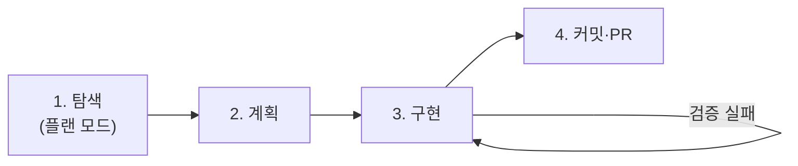
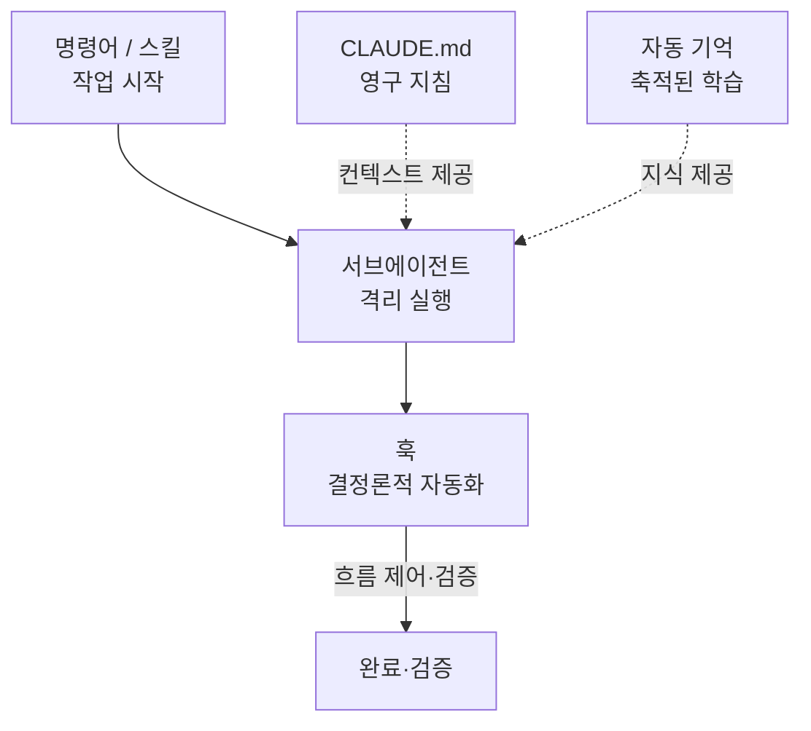

지금까지 배운 확장 조각들 — [명령어](#ch4), [CLAUDE.md](#ch5), [자동 기억](#ch6), [서브에이전트](#ch7), [스킬](#ch8), [훅](#ch9), [MCP·플러그인](#ch10) — 은 따로 쓰일 때보다 **엮일 때** 위력이 커집니다. 이 챕터는 그 조각들을 하나의 실전 워크플로로 조율하는 법을 다룹니다.

Claude Code는 질문에 답하고 기다리는 챗봇이 아니라 **에이전틱 코딩 환경**입니다. 코드를 짜서 리뷰를 부탁하는 대신, **원하는 것을 서술하면 Claude가 탐색·계획·구현**합니다. 이 자율성을 잘 다루는 열쇠는 단 하나의 제약에서 나옵니다.

> **모든 모범 사례는 한 제약으로 수렴합니다: 컨텍스트 창은 빠르게 차고, 찰수록 성능이 떨어진다.** 컨텍스트는 관리해야 할 가장 중요한 자원입니다. `/context`로 사용량을 계속 추적하세요.

---

## 워크플로 1 — 탐색 → 계획 → 구현 → 커밋

바로 코딩에 뛰어들면 **엉뚱한 문제를 푸는 코드**가 나옵니다. [플랜 모드](#)로 탐색과 실행을 분리하세요.



1. **탐색** — 플랜 모드 진입. 변경 없이 파일을 읽고 질문에 답. `read /src/auth 하고 세션·로그인 처리 방식을 이해해줘`
2. **계획** — `Google OAuth를 추가하려 해. 어떤 파일이 바뀌고 세션 흐름은? 계획을 세워줘.` (`Ctrl+G`로 계획을 에디터에서 직접 편집)
3. **구현** — 플랜 모드를 나와 계획대로 코딩하고 검증. `계획대로 OAuth를 구현하고, 콜백 핸들러 테스트를 작성해 실행·수정해줘.`
4. **커밋** — `설명적인 메시지로 커밋하고 PR을 열어줘.`

> **플랜 모드는 만능이 아닙니다.** 오타 수정·로그 한 줄 추가처럼 범위가 명확하고 작은 변경은 그냥 시키세요. 계획은 접근법이 불확실하거나, 여러 파일을 건드리거나, 낯선 코드를 만질 때 가장 유용합니다. **한 문장으로 diff를 설명할 수 있으면 계획을 건너뛰세요.**

---

## 워크플로 2 — 검증 수단을 반드시 줘라

Claude는 **작업이 끝나 보이면** 멈춥니다. 검증 수단이 없으면 "끝나 보임"이 유일한 신호가 되고, **당신이 검증 루프**가 됩니다. Claude가 읽을 수 있는 합격/불합격 신호를 주면 루프가 스스로 닫힙니다 — 작업하고, 검증하고, 통과할 때까지 반복.

검증은 대화에서 읽히는 신호면 무엇이든 됩니다: 테스트 스위트, 빌드 종료 코드, 린터, 출력을 픽스처와 비교하는 스크립트, 디자인과 비교하는 **스크린샷**.

| 게이트 강도 | 방법 |
| --- | --- |
| 한 프롬프트 | "구현 후 테스트를 실행해 통과할 때까지 반복해" |
| 세션 전체 | `/goal` 조건 — 매 턴 후 별도 평가자가 재확인 |
| 결정론적 게이트 | [Stop 훅](#ch9)이 스크립트로 검증, 통과 전엔 턴 종료 차단 |
| 제2의 의견 | [검증 서브에이전트](#ch7)가 새 모델로 결과를 반박 |

> **주장이 아니라 증거를 보이게 하세요** — 테스트 출력, 실행한 명령과 결과, 스크린샷. 증거 리뷰가 당신이 직접 재검증하는 것보다 빠릅니다.

---

## 워크플로 3 — 구체적으로 지시하라

Claude는 의도를 추론할 수는 있어도 마음을 읽지는 못합니다. **정밀한 지시일수록 교정이 줄어듭니다.**

| 전략 | 나쁨 | 좋음 |
| --- | --- | --- |
| 범위 지정 | "foo.py에 테스트 추가" | "foo.py에 **로그아웃 상태 엣지케이스**를 다루는 테스트를 작성해. **목(mock) 없이.**" |
| 출처 지목 | "왜 이 API가 이상해?" | "ExecutionFactory의 **git 히스토리를 훑어** API가 어떻게 생겨났는지 요약해" |
| 기존 패턴 참조 | "캘린더 위젯 추가" | "홈의 기존 위젯 구현을 봐. **HotDogWidget.php가 좋은 예시**야. 그 패턴을 따라..." |
| 증상 서술 | "로그인 버그 고쳐" | "세션 타임아웃 후 로그인 실패. `src/auth/`의 토큰 갱신을 확인하고, **재현 실패 테스트를 먼저 쓴 뒤** 고쳐" |

- **리치 컨텍스트 제공**: `@파일` 참조, 이미지 붙여넣기, 문서 URL(`/permissions`로 도메인 허용), `cat error.log | claude`로 파이프.
- **큰 기능은 Claude가 당신을 인터뷰하게**: "이걸 만들고 싶어. `AskUserQuestion` 도구로 기술 구현·UX·엣지케이스를 인터뷰하고, 다 다루면 `SPEC.md`에 스펙을 써줘." → 새 세션에서 깨끗한 컨텍스트로 스펙을 실행.

---

## 워크플로 4 — 세션을 능동적으로 관리하라

대화는 영속적이고 되돌릴 수 있습니다. 이를 활용하세요.

- **일찍, 자주 교정**: `Esc`로 중단(컨텍스트 보존 후 방향 전환), `Esc Esc`/`/rewind`로 체크포인트 복원, "방금 거 되돌려", 작업 전환 시 `/clear`.
- **두 번 교정했다면 `/clear`**: 같은 이슈로 두 번 넘게 고쳤다면 컨텍스트가 실패한 시도로 오염된 상태입니다. `/clear` 후 배운 것을 반영한 더 나은 프롬프트로 시작하는 편이 거의 항상 낫습니다.
- **컨텍스트 공격적 관리**: 무관한 작업 사이엔 `/clear`. `/compact <지시>`로 방향 있는 압축. 곁가지 질문은 `/btw`(히스토리에 안 남음).
- **리서치는 서브에이전트로**: "서브에이전트로 X를 조사해" — 별도 컨텍스트에서 탐색하고 요약만 돌려받아 메인을 깨끗이 유지.

---

## 워크플로 5 — 자동화·병렬로 확장

한 Claude에 익숙해지면 병렬 세션·비대화 모드로 출력을 배가합니다.

- **비대화 모드**: `claude -p "프롬프트"`를 CI·pre-commit·스크립트에. `--output-format json`으로 결과 파싱, `--allowedTools`로 무인 실행 권한 제한.
- **병렬 세션**: [git 워크트리](#)로 충돌 없는 격리 체크아웃, 데스크톱 앱의 시각적 다중 세션, 에이전트 팀의 자동 조율.
- **세션 간 메시지**(v2.1.224+, macOS·Linux): 세션끼리 직접 메시지를 주고받습니다 — `ListAgents`로 다른 세션을 찾고 `SendMessage`로 보냅니다. 한쪽에서 바뀐 사실을 다른 쪽에 **여러분이 다시 설명하지 않아도** 되는 것이 요점입니다. 오가는 것은 Claude가 쓴 **텍스트뿐**이고 대화 기록이나 파일은 넘어가지 않으며, [오토 모드](#ch2)에서는 보내는 메시지도 분류기가 검사합니다.
- **Writer/Reviewer 패턴**: 새 컨텍스트는 리뷰 품질을 높입니다(Claude가 자기가 쓴 코드에 편향되지 않음). 한 세션이 구현하면, 다른 세션이 리뷰.
- **파일 팬아웃**: 대규모 마이그레이션은 파일 목록을 만들고 루프로 `claude -p` 호출.

```bash
for file in $(cat files.txt); do
  claude -p "Migrate $file from React to Vue. Return OK or FAIL." \
    --allowedTools "Edit,Bash(git commit *)"
done
```

- **오토 모드**: `claude --permission-mode auto -p "fix all lint errors"` — 분류기 모델이 위험한 명령만 차단하며 무인 실행.

---

## 조각들이 맞물리는 그림



- **명령어/스킬**이 작업을 시작하고, 필요하면 **서브에이전트**에 위임한다.
- **CLAUDE.md**와 **자동 기억**이 그 실행에 맥락과 학습을 공급한다.
- **훅**이 특정 시점마다 결정론적으로 개입해 포맷·검증·정책을 강제한다.

---

## 피해야 할 실패 패턴

| 패턴 | 처방 |
| --- | --- |
| **잡동사니 세션** — 무관한 작업이 섞여 컨텍스트가 오염 | 작업 사이 `/clear` |
| **반복 교정** — 실패한 접근으로 컨텍스트 오염 | 2번 실패 후 `/clear` + 더 나은 프롬프트 |
| **과잉 CLAUDE.md** — 길어서 규칙이 묻힘 | 무자비하게 가지치기, 규칙은 [훅](#ch9)으로 전환 |
| **신뢰-검증 격차** — 그럴듯하지만 엣지케이스 미처리 | 항상 검증 수단(테스트·스크립트·스크린샷) 제공 |
| **무한 탐색** — 범위 없는 "조사"가 컨텍스트를 삼킴 | 범위를 좁히거나 서브에이전트로 격리 |

---

## 핵심 요약

- 모든 것은 **컨텍스트 관리**로 수렴한다 — `/clear`·`/compact`·서브에이전트가 핵심 무기.
- **탐색→계획→구현→커밋**으로 엉뚱한 문제 풀기를 막고, **검증 수단**으로 루프를 스스로 닫게 하라.
- 구체적으로 지시하고, 일찍 교정하고, 두 번 실패하면 리셋하라.
- 명령어·CLAUDE.md·서브에이전트·스킬·자동기억·훅이 **하나의 오케스트레이션**으로 맞물릴 때 무인 실행이 가능해진다.
