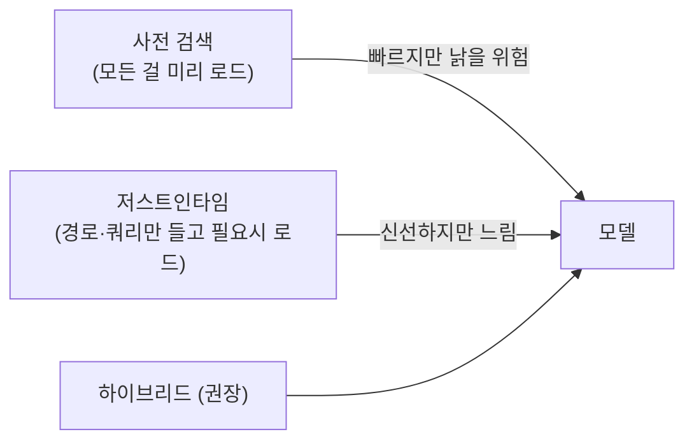

이 강의 내내 반복된 한 문장 — "컨텍스트 창이 가장 중요한 자원이다" — 을 이제 정면으로 다룹니다. **컨텍스트 엔지니어링(context engineering)**은 2025년 이후 프롬프트 엔지니어링의 후계로 떠오른 개념으로, Anthropic은 이를 "추론 시점에 **최적의 토큰 집합을 큐레이션·유지**하는 전략"으로 정의합니다.

## 프롬프트 → 컨텍스트 엔지니어링

- **프롬프트 엔지니어링**: 한 번의 교환에서 보낼 **텍스트(지시)를 최적화**하는 것.
- **컨텍스트 엔지니어링**: 여러 턴에 걸쳐 모델이 받는 **정보 전체를 큐레이션**하는 것 — 시스템 프롬프트뿐 아니라 도구 출력, 파일 내용, 기억, 히스토리까지.

에이전트는 반복적으로 동작하며 데이터를 계속 생성합니다. 그래서 매 추론마다 "**어떤 정보 구성이 원하는 행동을 가장 잘 끌어낼까**"를 묻는, 순환적으로 다듬어지는 작업이 됩니다.

---

## 컨텍스트는 유한 자원 — 컨텍스트 로트

> **핵심 통찰:** LLM에는 인간의 작업기억처럼 **어텐션 예산(attention budget)**이 있습니다. 토큰이 늘수록 그 예산이 소진되어, **정보를 정확히 기억·집중하는 능력이 떨어집니다.** 이를 **컨텍스트 로트(context rot)**라 합니다.

- 트랜스포머는 토큰 간 **n² 쌍 관계**를 만들어, 규모가 커질수록 어텐션이 얇게 퍼집니다.
- 성능 저하는 **절벽이 아니라 완만한 하강(gradient)**입니다 — 갑자기 못 하게 되는 게 아니라 서서히 흐려집니다.
- **즉, 1M 컨텍스트 창을 다 채운다고 더 좋아지지 않습니다.** 목표는 "**원하는 결과 확률을 최대화하는, 가장 작은 고신호(high-signal) 토큰 집합**"을 찾는 것입니다.

---

## 4가지 큐레이션 영역

Anthropic이 제시하는 컨텍스트 엔지니어링의 실천 영역입니다.

### 1) 시스템 프롬프트 — "적정 고도(right altitude)"

두 실패 사이의 중간을 노립니다.

| 너무 낮음(brittle) | 너무 높음(vague) |
| --- | --- |
| 복잡한 if-else를 하드코딩 → 취약·유지보수 지옥 | 막연한 고수준 지침 → 행동을 못 이끎 |

**스위트 스팟**: 행동을 이끌 만큼 **구체적**이되, 강한 휴리스틱을 줄 만큼 **유연한** 지침. XML 태그/마크다운 헤더로 섹션을 나누고(`## 도구 지침` 등), 최소 프롬프트에서 시작해 실패 사례마다 명료함·예시를 더하세요. **"최소"가 "짧다"는 뜻은 아닙니다** — 기대 행동을 온전히 그리는 최소 정보입니다. ([CLAUDE.md 챕터](#ch5)의 "지우면 실수하는가?" 원칙과 동일한 정신입니다.)

### 2) 도구 설계 — 최소·명확·자기완결

- 각 도구는 **자기완결적**이고, 에러에 강하며, 용도가 **극도로 명확**해야 합니다.
- **비대한 도구 세트**는 기능이 겹쳐 판단을 모호하게 만듭니다. "**인간 엔지니어가 어떤 도구를 써야 할지 확정할 수 없다면, AI도 못 합니다.**"
- 필요한 정보만 반환해 **토큰 효율**을 높이세요.

### 3) 예시(few-shot) — 다양한 정준 예시

"LLM에게 예시는 천 마디 말과 같은 그림"입니다. 단, **엣지케이스를 빨래 목록처럼 나열하는 것은 안티패턴** — 컨텍스트만 부풀립니다. 기대 행동의 **전 범위를 대표하는 다양하고 정준적인 예시**를 소수 엄선하세요(양보다 질).

### 4) 검색 전략 — 저스트인타임 vs 사전 검색

- **저스트인타임**: 파일 경로·URL·쿼리 같은 **가벼운 식별자**만 들고, 필요할 때 도구로 로드. Claude Code가 `head`·`tail`·타깃 쿼리로 대용량 데이터를 통째로 안 읽고 다루는 방식.
- **하이브리드(권장)**: 속도를 위해 일부(예: `CLAUDE.md`)는 미리, 나머지는 `glob`·`grep`으로 자율 탐색.
- **점진적 공개(progressive disclosure)**: 탐색하며 필요한 맥락을 **점진적으로 발견**하고, 작업기억엔 필요한 것만 유지 — 인간의 인지와 같습니다.

---

## 긴 작업의 3대 기법

컨텍스트 창을 넘길 만큼 긴 작업에서 컨텍스트를 관리하는 세 축입니다. **이 강의에서 배운 기능들이 바로 이 기법의 구현체**입니다.

| 기법 | 무엇 | 이 강의의 구현 | 적합한 작업 |
| --- | --- | --- | --- |
| **압축(Compaction)** | 히스토리를 요약해 압축본+최근 맥락으로 재시작 | [`/compact`](#ch4), 자동 압축 | 대화 흐름이 중요한 긴 왕복 |
| **구조화 노트/에이전트 기억** | 외부에 노트를 쓰고 필요할 때 되불러옴 | [자동 기억·MEMORY.md](#ch6), 투두 | 마일스톤이 있는 반복 개발 |
| **서브에이전트 아키텍처** | 전문 서브에이전트가 깨끗한 컨텍스트로 처리, 요약만 반환 | [서브에이전트](#ch7) | 병렬 탐색이 유리한 복합 리서치 |

> **서브에이전트의 효율:** 각 서브에이전트는 수만 토큰을 탐색해도 **1,000~2,000 토큰 요약만** 메인에 돌려줍니다. 관심사가 깔끔히 분리되죠. **압축의 기술**: 먼저 재현율(recall)을 최대화(다 담기)한 뒤, 정밀도(불필요 제거)를 높입니다. 가장 쉬운 최적화는 **오래된 도구 호출 결과를 지우는 것** — 깊은 히스토리의 원시 출력은 거의 다시 쓰이지 않습니다.

---

## Claude Code에서의 실천

컨텍스트 엔지니어링은 추상 이론이 아니라 이미 배운 도구로 실천됩니다.

- **`/context`**로 무엇이 어텐션 예산을 먹는지 계속 관찰.
- **`/clear`**로 작업 전환마다 리셋, **`/compact <지시>`**로 방향 있는 압축.
- **CLAUDE.md는 짧고 적정 고도로**, 가끔 필요한 건 [스킬](#ch8)로 온디맨드.
- 고출력 탐색은 **서브에이전트로 격리**해 메인 컨텍스트를 지킴.
- 도구·MCP는 **최소·명확하게** — 겹치는 도구는 판단을 흐린다.

> **철학:** 모델이 좋아질수록 세밀한 지시가 덜 필요해지고, 에이전트에 더 많은 자율을 줄 수 있습니다. 그래도 원칙은 그대로 — "**작동하는 가장 단순한 것을 하라.**"

---

## 핵심 요약

- 컨텍스트 엔지니어링 = 추론마다 들어갈 **고신호 토큰을 큐레이션**하는 규율. 프롬프트 엔지니어링의 후계.
- 컨텍스트는 **유한한 어텐션 예산** — 채울수록 **컨텍스트 로트**로 성능이 완만히 하강한다. 1M을 다 채우지 마라.
- 실천 영역: **적정 고도 시스템 프롬프트 · 최소·명확 도구 · 정준 예시 · 저스트인타임/하이브리드 검색**.
- 긴 작업은 **압축·에이전트 기억·서브에이전트** 3대 기법으로 — 이 강의의 `/compact`·자동기억·서브에이전트가 그 구현이다.
