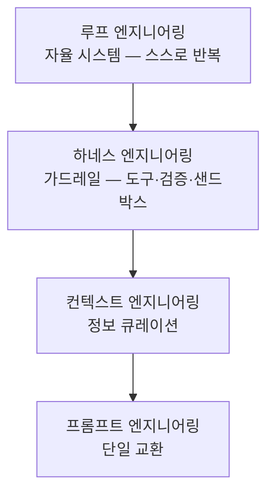
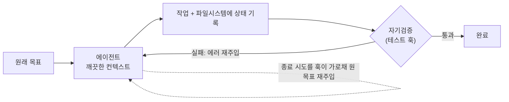

2026년 현재, AI 에이전트를 다루는 규율은 네 계층으로 정리됩니다. 이 마지막 챕터는 그중 상위 두 계층 — **하네스 엔지니어링**과 **루프 엔지니어링** — 그리고 커뮤니티에서 가장 많이 쓰는 기술들을 다룹니다.

## 네 가지 엔지니어링 계층

각 계층은 아래 계층 위에 쌓이는 **누적 스택**입니다.

| 계층 | 무엇 | 예 |
| --- | --- | --- |
| **프롬프트** | 한 번의 교환 텍스트 최적화 | "너는 코드 리뷰어다" 시스템 프롬프트 |
| **컨텍스트** | 여러 턴의 정보 큐레이션 | OpenAPI 스펙 + CLAUDE.md 규칙만, 무관 레거시 제외 |
| **하네스** | 에이전트를 둘러싼 전체 장치 | CLAUDE.md·도구·훅·테스트·리뷰 에이전트 |
| **루프** | 사람 개입 없이 자동 반복 | Ralph 루프, `/goal` 자율 실행 |

> **순서가 중요합니다.** "**모든 계층은 아래 계층의 약점을 물려받습니다.**" 나쁜 컨텍스트를 루프에 넣으면 실수가 느려지는 게 아니라 **증폭**됩니다 — 루프는 좋은 결정도, 실수도 함께 키웁니다. 그래서 루프 레벨에선 **검증(sensors)**이 결정적입니다.

---

## 하네스 엔지니어링

핵심 공식 한 줄: **에이전트 = 모델 + 하네스.** Viv Trivedy의 표현대로 "**당신이 모델이 아니라면, 당신이 하네스다.**" 원시 모델은 텍스트를 생성할 뿐이지만, 하네스가 감싸면 **상태를 유지하고, 도구를 실행하고, 실패에서 배우고, 제약을 강제하는 자율 에이전트**가 됩니다.

> **인상적인 데이터 포인트:** 같은 모델(Opus)을 두고, **단순한 설정**에서 돌릴 때보다 **Claude Code의 정교한 하네스** 안에서 Terminal Bench 점수가 극적으로 올랐다고 보고됩니다 — 순위 30위권에서 5위권으로. **모델을 바꾸지 않고 하네스만 바꿔서** 말이죠. 하네스가 얼마나 load-bearing인지 보여 줍니다.

### 하네스의 구성요소

| 구성요소 | 이 강의의 대응 |
| --- | --- |
| **지침 파일**(규칙·관례) | [CLAUDE.md](#ch5) — "60줄 이하, 각 규칙은 특정 실패에서 유래" |
| **도구·bash** | 미리 만든 핸들러보다 bash·코드 실행으로 동적 조합 |
| **샌드박스·격리** | 안전 실험 환경 ([권한·샌드박스](#ch2)) |
| **컨텍스트 관리** | 압축·도구출력 오프로딩·점진적 공개 ([컨텍스트 엔지니어링](#ch12)) |
| **검증·훅** | [훅](#ch9)으로 타입체크·차단·승인 강제 |
| **관찰성** | 비용·지연·트레이스 추적 |

### 두 방향 — 가이드 vs 센서

- **가이드(feedforward)**: 생성 **전에** 맥락·규칙을 준다 — CLAUDE.md, 스펙, 부트스트랩 템플릿.
- **센서(feedback)**: 생성 **후에** 결과를 검사하고 자기수정을 트리거한다 — 린트, 레이어 분리 테스트, 요구사항 검증 리뷰 에이전트.

### "Skill issue 리프레임"

하네스 엔지니어링의 태도: **에이전트의 실패를 모델 한계가 아니라 "설정 문제"로 본다.** 실수가 나오면 이야기로 넘기지 말고 **엔지니어링**하라 — 린트 훅을 추가하고, 규칙 문서를 고치고, 검증 단계를 넣어라. 이렇게 하면 실패가 일회성 일화가 아니라 **영구적 신호**가 되어 하네스가 계속 좋아집니다("래칫"처럼).

> **하네스는 사라지지 않고 이동합니다.** 모델이 좋아지면 어떤 스캐폴딩(예: 예전의 "컨텍스트 불안" 완화 장치)은 불필요해지지만, 새 실패 모드가 나타나 새 제약이 필요해집니다.

---

## 루프 엔지니어링

**"나는 더 이상 Claude를 프롬프트하지 않는다. Claude를 프롬프트하는 루프를 짠다."** — 이 한마디가 전환의 핵심입니다(Claude Code를 이끄는 Boris Cherny가 2026년에 밝힌 취지). 통제권이 사람에서 시스템으로 넘어갑니다.

루프 엔지니어링은 **영구 지침·스킬·서브에이전트·훅을 조합해 에이전트가 스스로 반복**하게 만듭니다 — 맥락 수집 → 행동 → 검증 → 자기수정 → 측정 가능한 목표에 도달할 때까지.

### `/goal` — 가장 깔끔한 진입점

완료 조건을 한 번 입력하면, 매 턴 후 **Haiku급 평가자**가 트랜스크립트를 읽고 "충족됐나?"를 판정해 될 때까지 반복합니다.

### Ralph 루프 (빌드-테스트-검증)

자율 코드 생성 루프의 대표 패턴입니다.

- 훅이 모델의 **종료 시도를 가로채** 원래 프롬프트를 **새 컨텍스트에 재주입**해 계속 일하게 합니다.
- 각 반복은 **깨끗하게 시작**하되, 이전 상태는 **파일시스템으로** 읽습니다([구조화 노트](#ch12)).
- 매 단계 후 훅이 테스트 스위트를 돌리고 **실패를 에러 텍스트와 함께 되먹임**합니다.

### Planner/Evaluator 분리

**생성하는 에이전트와 채점하는 에이전트를 분리**하세요. 모델은 자기 작업을 **낙관적으로** 채점하는 경향이 있기 때문입니다. 새 컨텍스트의 [검증 서브에이전트](#ch7)가 diff만 보고 반박하게 하는 [적대적 리뷰](#ch11)가 이 원리입니다.

> ⚠️ **루프의 위험:** "**무인으로 도는 루프는 무인으로 실수하는 루프**이기도 합니다." 그래서 루프에는 반드시 **센서(검증)**를 넣고, 오토 모드([2장](#ch2))의 분류기·`/goal` 평가자·Stop 훅으로 게이트를 겁니다.

---

## 커뮤니티 인기 기술·리소스

실무자들이 가장 많이 쓰는 오픈소스 모음입니다(GitHub).

| 리소스 | 무엇 |
| --- | --- |
| **awesome-claude-code** (hesreallyhim) | 스킬·에이전트·상태줄·툴링·플러그인 큐레이션의 표준 목록 |
| **awesome-claude-code-subagents** (VoltAgent) | 10개 카테고리 **100+개 전문 서브에이전트** 컬렉션 |
| **awesome-claude-skills** (ComposioHQ) | Claude 스킬·리소스 큐레이션 |
| **Superpowers** | 검증된 기법·패턴의 종합 **스킬 라이브러리** |
| **andrej-karpathy-skills** | LLM 코딩 함정 관찰을 담은 단일 `CLAUDE.md` |
| **awesome-harness-engineering** (ai-boost) | 하네스 엔지니어링(도구·평가·기억·MCP·권한·관찰성) 목록 |

**많이 쓰는 실전 패턴 요약**
- **서브에이전트 라이브러리**: 리뷰어·테스터·보안·리팩터 등 역할별 서브에이전트를 `.claude/agents/`에 두고 재사용.
- **관찰성 훅**: 툴콜·서브에이전트 시작/종료·권한 이벤트를 훅으로 로깅해 대시보드로 관측.
- **스킬 라이브러리 공유**: 팀 표준 절차를 스킬/플러그인으로 배포([MCP·플러그인](#ch10)).
- **스펙 주도 개발**: Claude가 `AskUserQuestion`으로 인터뷰 → `SPEC.md` 작성 → 새 세션에서 실행([11장](#ch11)).

> **주의:** 커뮤니티 자산은 외부 코드입니다. 서브에이전트·스킬·플러그인·MCP를 도입하기 전 **내용을 검토**하고, 신뢰할 수 있는 출처만 쓰세요.

---

## 핵심 요약

- 네 계층: **프롬프트 → 컨텍스트 → 하네스 → 루프** (누적 스택). 위 계층은 아래의 약점을 물려받는다.
- **하네스 = 모델 + 장치.** 같은 모델도 하네스만으로 성능이 크게 달라진다. 실패는 "설정 문제"로 보고 훅·규칙·검증으로 래칫하라.
- **루프 엔지니어링**은 사람 대신 시스템이 반복하게 한다 — `/goal`·Ralph 루프·planner/evaluator 분리. **무인 루프엔 반드시 센서(검증).**
- 커뮤니티(awesome-claude-code·VoltAgent 서브에이전트·Superpowers 등)의 검증된 자산을 **검토 후** 활용하라.
