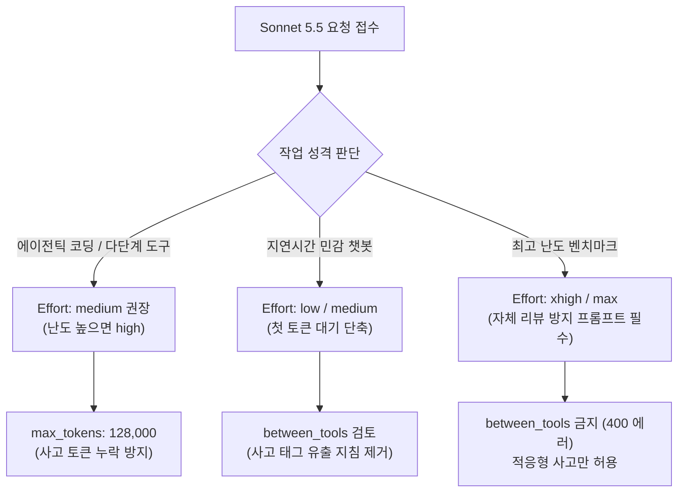

[3장](#ch3)에서 본 최신 모델 — **Opus 5.5·Fable 5.1·Sonnet 5.5** — 은 이전 세대보다 훨씬 똑똑하고 자율적입니다. 기존 프롬프트로도 기본 동작하지만, **더 자율적으로 오래 일하기 때문에** 지시하는 방식도 진화해야 합니다.

이 챕터는 Anthropic 공식 **Opus 5.5 실전 활용 플레이북(*"Getting the most out of Opus 5.5 in Claude and Claude Code"*, Addy Osmani)**, **Sonnet 5.5 에이전트 빌딩 가이드(*"Building with Claude Sonnet 5.5"*, Addy Osmani)**, **Sonnet 5.5 공식 프롬프트 가이드(*"Prompting Claude Sonnet 5.5"*, Anthropic Official Docs)**, 그리고 **Fable 5.1 프롬프트 가이드(*"Prompting Claude Fable 5.1"*, Thariq Shihipar)**를 바탕으로, 실무 에이전틱 코딩의 핵심 패턴과 보안 지침을 집대성했습니다.

> **대원칙:** 모델이 발전할수록 **스캐폴딩(scaffolding)을 덜어내야** 합니다. 예전 모델을 밀어붙이려고 넣었던 지시(과도한 검증 강제·재확인·단계별 번호 강요)는 최신 모델에서 **과잉 행동과 토큰 낭비**를 낳습니다. 반면 **"완료의 정의(Finish line)"**와 **"위험 작업 전 멈춤 지점"**은 명확히 못 박아야 안전하게 오랜 시간 자율 주행할 수 있습니다.

---

## 1부: 최신 모델 공통 튜닝 패턴

### 1) 응답이 길어졌다 → 간결하게 지시
최신 세대의 기본 사용자 응답은 이전 세대보다 **깁니다**. **effort는 "얼마나 생각하는지"를 조절할 뿐, "얼마나 말하는지"는 아닙니다** — effort를 낮춰도 응답 텍스트가 확실히 짧아지지 않습니다. 출력 길이는 **명시적으로 프롬프트**하세요.

```text
Keep responses focused, brief, and concise. Keep disclaimers and caveats short,
and spend most of the response on the main answer. When asked to explain something,
give a high-level summary unless an in-depth explanation is specifically requested.
```

### 2) 진행 상황을 많이 내레이션한다 → 소통 케이던스 지정
에이전틱 작업 중 최신 모델은 "이제 무엇을 할지"를 자주 예고하고, 턴당 출력이 길어질 수 있습니다. **소통 방식을 명시**하면 조절됩니다.

```text
Before your first tool call, say in one sentence what you're about to do.
While working, give a brief update only when you find something important or
change direction. When you finish, lead with the outcome: your first sentence
should answer "what happened" or "what did you find," with supporting detail after.
```

### 3) 스스로 검증한다 → 과잉 검증 지시를 빼라
최신 모델은 **시키지 않아도 자기 작업을 검증**합니다. 프롬프트에 "비자명한 작업엔 최종 검증 단계를 넣어라", "서브에이전트로 2중 검증해라" 같은 지시가 있으면 **제거**하세요 — 최신 모델에선 과잉 검증 루프를 유발해 토큰만 낭비합니다.

```text
Deliver what was asked, at the scope intended. Make routine judgment calls yourself,
and check in only when different readings of the request would lead to materially
different work. Finish the whole task, and stop short of actions that are clearly
beyond what was asked.
```

### 4) thinking을 끄면 생기는 아티팩트
Opus 5.5와 Fable 5.1은 **적응형 사고(adaptive thinking)가 상시 활성화**되어 있으며 끄는 옵션이 제공되지 않습니다. 구세대 모델에서 사고를 강제로 끄면 도구 호출이 텍스트로 새거나 `<thinking>` 태그가 노출되는 문제가 발생합니다. **사고를 끄려고 하지 말고, 비용 절감이 필요하면 `low` 또는 `medium` effort를 사용하는 것**이 정석입니다.

---

## 2부: Claude Opus 5.5 실전 활용 플레이북

Anthropic이 2026년 9월 22일 발표한 **Claude Opus 5.5**(`claude-opus-5-5`)는 이전 세대보다 **혼자서 훨씬 더 오래 일하고, 자신이 수행한 작업을 담백하게 보고하며, 매 응답 전 스스로 생각**합니다.


### 첫 세션에서 시도할 3가지 핵심
1. **작업 전체를 한 번에 넘겨라**: "완료된 모습(Done)"이 무엇인지, 언제 멈춰서 질문해야 하는지 한 번에 말하고 그대로 작업을 맡기세요.
2. **"깊이 생각해라" 문구를 삭제하라**: Opus 5.5는 이미 매 응답 전 최적의 깊이로 생각합니다. "think carefully"를 지우면 답변이 더 빨리 시작됩니다.
3. **작업이 끝나면 나에게 필요한 요구사항을 먼저 읽어라**: Opus 5.5는 자신이 내린 결정과 사람의 승인이 필요한 항목을 명확히 구분해 보고합니다.

---

### 1. 프롬프트 작성법 (How to Ask)

#### ① 완료의 기준(Finish Line)을 못 박고 맡겨라
Opus 5.5는 이전 Opus 5보다 다단계 작업(대규모 리포지토리 마이그레이션 등)을 훨씬 더 끈기 있게 이어갑니다. "끝이 어디인지"를 명확히 주면 몇 시간 동안 자율적으로 작업합니다.

```text
# 실전 프롬프트: 결제 엔드포인트 마이그레이션
Migrate the payment endpoints from the old client to the new one.
Done means: every endpoint uses the new client, the old client is
deleted, and the test suite passes.
Stop and ask me only if a test fails for a reason you can't explain.
```

- **전체 과업**: 구 클라이언트에서 신규 클라이언트로 결제 엔드포인트 마이그레이션.
- **완료의 정의 (Done)**: 모든 엔드포인트가 신규 클라이언트를 사용하고, 구 클라이언트 파일이 삭제되며, 전체 테스트가 통과할 것.
- **멈춤 조건**: 설명할 수 없는 이유로 테스트가 실패할 때만 멈추고 질문할 것.

#### ② "think hard" 지시문 제거
"think carefully", "think step by step" 등의 프롬프트는 모두 삭제하세요. Opus 5.5는 자체적으로 생각의 양을 결정합니다. 빠른 답변이 필요하다면 `"Answer directly"`라고 짧게 지시하거나 effort를 `low`로 낮추세요.

#### ③ 실행 중인 작업에 실시간 지시 추가 (Add to a running task)
Opus 5.5는 긴 시간 동안 도구를 연속 실행합니다. 도중에 빠뜨린 요구사항이 생각났다면 작업을 취소하고 처음부터 다시 시작할 필요 없이, **작업이 돌아가는 도중에 터미널에 메시지를 입력하고 Enter를 누르세요**.
- 예: 작업 도중 `Also keep the old endpoint names as aliases.` 입력.

#### ④ 디자인 요청 시 "원하지 않는 스타일"을 명시 (Negative Styling Constraints)
스타일 지침이 없으면 Opus 5.5는 무난한 기본 템플릿(크림색 배경, 이탤릭 헤딩, 알약 모양 버튼 등)으로 회귀합니다. "일반적인 느낌을 피해라" 같은 막연한 지시 대신, **원하지 않는 스타일 요소를 구체적으로 나열**하세요.

```text
Build a personal website with placeholder content.
Don't use a cream or off-white background, italic accent words in
headings, numbered "01 / 02 / 03" section labels, monospace labels, or
pill-shaped buttons.
```

---

### 2. Claude Code에서 장기 실행 세션 조종 (Steering a Long Run)

#### ① CLAUDE.md에 멈출 지점(Stops)을 명시하라
Opus 5.5는 보고를 매우 잘합니다. 하지만 지침이 없으면 사소한 판단마다 멈춰서 "계속할까요?"라고 묻거나 불필요한 선택지를 나열할 수 있습니다. `CLAUDE.md`에 연속 진행과 정지 조건을 명시하세요.

```markdown
<!-- CLAUDE.md 권장 규칙 -->
When a step doesn't need my input, keep going. Put status notes in the
same message as your next action.
Stop and ask only when you can't continue without me, or before anything
destructive: deleting data, force-pushing, or changing anything outside
this repository.
```

> ⚠️ **보안 원칙:** 멈춤 없이 계속 진행하게 할수록, 파괴적 작업(`rm -rf`, `git push --force`, 외부 디렉터리 접근)에 대한 사전 확인 및 Claude Code의 도구 권한 프롬프트는 반드시 켜 두어야 합니다.

#### ② 대규모 작업은 서브에이전트에 분산 후 "증거"를 검증하라
전체 서비스 감사(audit)나 대규모 마이그레이션 시, Opus 5.5에게 작업을 여러 서브에이전트로 나누고 각 결과를 병합 전 교차 검증하도록 지시하세요.

```text
Audit every service in services/ for the retry bug in the linked issue.
Give each service to its own subagent. When a subagent reports back,
check its evidence before you accept it.
Finish with one table: service, affected yes or no, and the evidence.
```

#### ③ 작업 목록을 파일(`TASKS.md`)로 유지하라
긴 세션에서는 대화 컨텍스트가 가득 차면 Claude Code가 이전 턴을 자동 요약(compaction)합니다. 작업 진행 상태를 터미널 대화에만 의존하면 히스토리가 요약될 때 세부 사항이 흐려질 수 있습니다.
- 지시: `"Keep a checklist in TASKS.md. Tick each item when it's done, and add anything new you find."`
- 파일에 기록된 체크리스트는 컨텍스트 압축 후에도 디스크에 온전히 유지되어 현재 위치를 한눈에 파악할 수 있습니다.

---

### 3. 결과 확인 및 품질 점검 (Checking the Result)

#### ① "나에게 필요한 요구사항"을 가장 먼저 읽어라
장기 작업이 끝나면 최종 요약에서 Claude가 사람의 결정이나 승인을 기다리는 항목(**Blocked on me**)을 가장 먼저 확인하세요.
- `CLAUDE.md` 서식 팁: `"End every run with three headings: Blocked on me, Changed, Found."`

#### ② 머지 전 Opus 5.5에게 사전 코드 리뷰 요청
Opus 5.5는 낮은 effort에서도 이전 Opus 5의 높은 effort보다 더 많은 버그를 적은 오탐(false positive)으로 잡아냅니다. 사람이 PR을 검토하기 전 먼저 돌려보세요.

```text
Review the diff on this branch against main.
List only problems you'd block the merge for. For each one, give the
file and line, why it's wrong, and how to show it fails.
```

#### ③ 확인하지 못한 부분을 명시하도록 지시
조사 및 분석 작업 시 확인되지 않은 가설을 단정 짓지 않도록 명시적 단서를 붙이세요:
- `"Mark anything you couldn't confirm, and say where you looked."`

---

### 4. Claude 애플리케이션 및 협업 팁

- **스크린샷/차트 원본 직접 첨부**: 수치를 텍스트로 옮겨 적지 말고 다이어그램이나 스크린샷 이미지를 그대로 전달하세요. 화살표 연결 관계, 두 다이어그램 간 변경점, 캘린더 일정 위치 등 공간 정보를 탁월하게 해석합니다.
- **문서 자기모순 검출**: 긴 기획서나 슬라이드 덱 검토 시 *"문서 내에서 날짜·숫자·이름이 서로 모순되는 부분을 찾아 인용하고 위치를 밝혀라"*고 지시하세요.
- **완성형 파일 직접 요구**: 개요(outline) 대신 바로 공유할 수 있는 완성된 스프레드시트나 정식 문서를 요구하세요.
- **긴 프로젝트 대화에서 이전 답변 확정 선언**: 장기 프로젝트에서 사소한 후속 질문 시 이전 답변을 불필요하게 재검토하며 느려지는 것을 방지하려면 지침을 추가하세요:
  ```text
  Once you have answered something, treat that answer as done. Focus on
  what I'm asking now, and don't go back over an earlier answer unless I
  ask about it or point out a problem with it.
  ```

---

### 5. 보안 가드레일 및 메시지 플래그 대응

Opus 5.5는 Fable 수준의 첨단 생물학·사이버보안 가드레일을 기본 탑재했습니다.

1. **메시지 플래그 시 자동 모델 폴백**: 민감한 보안 키워드나 오탐으로 인해 메시지가 플래그되면, 작업이 튕겨 나가는 대신 이전 세대 안전 모델로 세션이 자동 전환되어 연속성을 보장합니다.
2. **복구 절차**:
   - 원래 모델 복귀: `/model opus-5-5`
   - 직전 메시지 수정: `Esc` 키를 두 번 눌러 프롬프트 편집 후 재전송
   - 자동 전환 여부 제어: `/config`에서 `Switch models when a message is flagged` 옵션 조정
3. ⚠️ **내부 추론 과정(Internal Reasoning) 출력 요구 금지**:
   - "내부 추론 과정을 그대로 보여달라"는 식의 시스템 내부 사고 추출 요청은 보안상 거부되며 플래그의 주요 원인이 됩니다.
   - 대안: *"이 방식을 선택한 이유를 3문장으로 간결하게 설명해 달라"*와 같이 명시적 산출물 설명을 요구하세요.

---

### Opus 5.5 실전 체크리스트

```markdown
[ ] 1. 지시하기 (Asking)
    - 작업의 최종 완료 모습(Done)을 명시했는가?
    - "think hard", "think carefully" 같은 불필요한 수식어를 제거했는가?
    - 디자인 요청 시 원하지 않는 스타일(배경색, 폰트 등)을 나열했는가?
    - 차트와 다이어그램은 텍스트 재입력 대신 이미지 원본을 첨부했는가?

[ ] 2. 긴 세션 조종 (Steering)
    - CLAUDE.md에 불필요한 정지를 막고 파괴적 명령(삭제, force-push) 전에만 멈추도록 설정했는가?
    - 파괴적 도구 권한 프롬프트는 켜 두었는가?
    - 대규모 감사·마이그레이션 과제는 서브에이전트로 분산하고 증거를 요구했는가?
    - 진행 상황 추적을 위한 TASKS.md 체크리스트 파일 생성을 지시했는가?

[ ] 3. 결과 점검 (Checking)
    - 최종 보고서에서 'Blocked on me(내 승인이 필요한 사항)'를 가장 먼저 확인했는가?
    - 머지 전 Opus 5.5에게 머지 블로커 기준 diff 리뷰를 수행하게 했는가?
    - 조사 리포트에서 '확인하지 못한 내용과 검색 위치'를 표기하도록 했는가?

[ ] 4. 보안 및 플래그 (Flags)
    - 플래그 발생 시 /model 또는 Esc 2회 수정을 통해 복구하는 법을 숙지했는가?
    - 내부 reasoning을 출력하라는 무리한 지시를 배제했는가?
```

---

## 3부: Claude Sonnet 5.5 공식 프롬프트 가이드 (Anthropic Official)

Anthropic 공식 엔지니어링 문서인 [**"Prompting Claude Sonnet 5.5"**](https://platform.claude.com/docs/en/build-with-claude/prompt-engineering/prompting-claude-sonnet-5-5)는 Sonnet 5.5 모델 전용의 10대 실전 프롬프팅 패턴과 API 제약 회피 기법을 규정하고 있습니다. 기존 Sonnet 5 프롬프트도 기본 작동하지만, Sonnet 5.5의 재보정된 추론 강도(effort)와 자율성 특성을 이해하고 지시해야 성능과 비용 효율을 극대화할 수 있습니다.



### 1) Effort 재조정과 출력 토큰 한도 (Calibrate Effort)
- **Effort 레벨 재보정**: Sonnet 5.5의 effort 레벨은 Sonnet 5와 동일한 사고량을 의미하지 않습니다. 기존 설정을 그대로 이관하지 말고 재평가해야 합니다.
  - **API 기본값**: `high`
  - **에이전틱 코딩 & 다단계 도구**: 명세가 명확한 일상 작업은 **`medium`에서 시작**하고, 어렵거나 긴 작업은 `high`로 상향 권장.
  - **대화형 챗봇/지연 민감 작업**: `medium` 또는 `low`에서 시작 (high 이상은 첫 토큰 생성 전 thinking으로 인해 대기 시간이 길어짐).
- **`max_tokens` 128,000 최대치 설정**:
  - `max_tokens` 예산은 클라이언트에 반환되지 않는 내부 thinking 토큰까지 합산하여 차감됩니다. thinking 없는 모델 기준의 작은 한도를 두면 응답 중간에 잘립니다.
  - 코딩 세션에서는 반드시 모델 최대치인 **`max_tokens: 128000`**으로 설정하고 스트리밍(streaming)하세요.
- **`output_config.effort`(beta)로 프롬프트 캐시 보존**:
  - 요청의 최상위 `effort` 값을 변경하면 시스템 프롬프트 캐시가 무효화됩니다.
  - 턴별로 추론 강도를 바꾸려면 **메시지 단위 effort 변경(per-message effort change, beta)**을 사용하세요. (예: 일반 대화는 `low`로 유지하다가 어려운 코딩 문제가 들어올 때 해당 턴만 `high`로 상향). 단, 이 기능은 적응형 사고(adaptive thinking)에서만 지원되며 `between_tools` 설정 시 400 에러를 반환합니다.

### 2) 자율성과 작업 범위 제어 (Steer Initiative & Scope)
Sonnet 5.5의 행동 반경은 effort 수준과 프롬프트 지시에 민감하게 반응합니다:
- **조기 중단 방지 (`low`/`medium`)**: 낮은 effort에서는 다단계 작업 도중 불필요하게 멈춰서 계획을 확인하려 하거나 계속할지 묻는 경향이 있습니다. 다음 시스템 프롬프트로 끝까지 완수하도록 조종하세요:
  ```text
  Keep working until everything the user asked for is done, and only stop to ask when you can't go on without the user or before a risky step. When the work the user asked for is done and checked, stop and report. Don't add features, tests, files, docs or refactors that weren't asked for. If you think one would help, mention it at the end instead of doing it.
  ```
- **요청하지 않은 추가 작업 방지**: Sonnet 5.5는 코드 변경 시 저장소 관례에 맞게 테스트, 문서, 지원 파일을 알아서 추가하는 성향이 강합니다. 요청된 부분만 수정하길 원한다면 위 프롬프트의 뒷부분(`When the work the user asked for is done...`)만 시스템 프롬프트에 주입하세요.
- **`xhigh`/`max`에서 무한 자체 리뷰 루프 방지**: 최상위 effort에서는 과업 완료 후 스스로 코드 리뷰와 하드닝을 시작하거나 서브에이전트를 띄워 검토를 반복하며 토큰을 소모합니다. 다음 지침을 주입하면 서브에이전트 남발을 막고 **비용을 약 30% 절감**할 수 있습니다:
  ```text
  When the work the user asked for is done and its checks pass, stop and report. Don't start extra rounds of review or hardening on your own, and don't launch reviewer sub-agents unless the user asked for a review. If you think a deeper review is worth doing, say so at the end.
  ```
- **아이디어/기획 요청 시 산출물 빌드 방지**: "이걸로 뭘 할 수 있는지 보여줘" 같은 열린 요청에서 모델이 즉시 앱이나 리포트를 제작하는 것을 방지합니다:
  ```text
  When the user asks for ideas, options or a plan, give them that and stop. Don't start building or changing anything until they say to go ahead.
  ```

### 3) 선행 사고 없는 실행 (`between_tools`와 제약사항)
- Sonnet 5.5에서 첫 턴의 선행 사고 없이 즉시 응답하려면 **`thinking: {"type": "between_tools"}`**를 전송합니다.
- ⚠️ **핵심 제약**:
  - `between_tools`는 **`high` 이하 effort에서만 허용**됩니다. `xhigh`나 `max`에서 전송하면 **HTTP 400 Bad Request** 에러가 발생합니다.
  - "생각하지 말라(do not think)"는 프롬프트 지시는 제거해야 합니다. 모델이 보이는 출력에 내부 `<thinking>` XML 태그를 누출할 위험이 커집니다.
  - 도구 호출 사이에 모델이 작성한 중간 메모는 thinking 블록으로 수신되므로, 다음 턴에 원본 그대로 다시 전달(Append-only)해야 합니다.

### 4) 정형 JSON 출력과 추론 태스크 (Reasoning with JSON)
문서 수치 집계, 규칙 적용, 순위 매기기 등 계산/추론이 필요한 태스크에서 JSON 출력을 요구할 때:
- **구조화된 출력(Structured Outputs)** 사용 시:
  - 본문에는 스키마에 맞는 JSON만 들어가므로 모델은 **오직 thinking 블록 내에서만 문제를 풀 수 있습니다**.
  - `low`/`medium`에서는 추론을 건너뛰고 오답을 낼 수 있으므로 시스템 프롬프트 끝에 반드시 한 줄을 추가하세요:
    ```text
    Think the problem through before you answer.
    ```
  - `stop_reason: "max_tokens"`가 떨어지면 JSON이 유효해 보여도 실패로 간주하고 재시도하세요.
- **자유 형식(Free-form) 프롬프트로 JSON을 요청할 때**:
  - 모델이 본문에서 풀이 과정을 서술한 뒤 마지막에 JSON을 작성하므로, 전체 응답을 파싱하려 하면 실패합니다.
  - **파싱 원칙**: `{` 또는 `[`로 시작하는 JSON 블록을 탐색하고, **가장 마지막에 완성된 JSON 블록만 추출**하여 파싱하세요.

### 5) 사용자 진행 상황 실시간 업데이트 (Progress Updates)
- 도구 호출 사이의 메모를 실시간으로 보여주려면 `display: "updates"` 헤더(`thinking-display-updates-2026-08-18`)를 지정하세요.
- 긴 도구 체인에서 5턴 이상 침묵이 이어질 경우, 하네스가 일회성 턴 스코프 메시지를 주입합니다:
  ```text
  The user hasn't heard from you in a while — say in a few words what you're doing, then continue.
  ```

### 6) 지식 및 웹 검색 도구 활용 (Tool Use & Search)
- "도구 사용을 최소화하라"는 구형 지침을 삭제하세요.
- 최신 규정, 요금, 지원 여부 등 지식 컷오프 이후 변경될 수 있는 내용은 내부 학습 지식 대신 검색 도구를 강제하세요:
  ```text
  Use the search tool to check specifics that may have changed since your training, such as what is allowed, required or charged, even when you feel confident. For researched work such as a report or a comparison, gather current sources rather than writing from your training knowledge.
  ```

### 7) 미드턴 사용자 메시지와 간접 인젝션 방어 (Mid-turn Messages)
Sonnet 5.5는 도구 결과나 파일 내용으로 침투하는 간접 프롬프트 인젝션(indirect prompt injection)을 강력히 방어하도록 훈련되었습니다. 잘못된 하네스 구조는 진짜 사용자의 메시지를 인젝션 공격으로 오탐하게 만듭니다.
- 🚨 **절대 `tool_result` 블록 내부에 사용자 텍스트를 넣지 마세요.**
- 사용자의 피드백은 반드시 도구 결과 블록이 모두 끝난 뒤 **별도의 `text` 블록**으로 메시지 끝에 추가(Append)해야 합니다.
- 매 도구 호출마다 토큰 카운트다운이나 하네스 공지 텍스트를 삽입하지 마세요.

### 8) 코딩 실검증 강제 지침 (Verification on Coding Tasks)
Sonnet 5.5는 기본적으로 자체 검증을 수행하지만, `low` effort에서는 "의존성이 설치되지 않았다"는 등의 이유로 빌드나 테스트 실행을 건너뛸 수 있습니다. 다음 검증 강제 지침을 시스템 프롬프트에 추가하세요:
```text
When you change code that can be run, built, or type-checked, run a real check that exercises the change before reporting it done: the project's tests, type-checker, or build, or the changed command itself. A syntax-only check, or a check command that failed to start, does not count; if all that is missing is the project's declared dependencies, install them with its own package manager and lockfile (e.g. npm install, pip install -r requirements.txt), never via sudo or the system package manager, unless told not to. Only if no real check can run here, say which one you did not run and why instead of reporting the change as done.
```

### 9) 관용적 도구 호출 처리 (Tolerant Tool-Call Handling)
- Sonnet 5.5가 `Bash` 대신 `bash`로 대소문자를 다르게 호출하거나 매개변수 이름을 유사하게 넘길 때, 에러로 중단하지 마세요.
- 하네스에서 명백한 매칭은 관용적으로 수용하거나, `tool_result`에 `is_error: true`와 함께 정확한 규격명을 안내하여 자체 교정(self-correction)을 유도하세요.

### 10) 복합 시각 입력 & 5대 안전 거부(Safeguard Refusals) 대응
- **차트 및 기술 도면**: effort를 올리는 것보다 이미지의 특정 영역을 자르고 확대하는 **Crop/Zoom 도구**를 제공하는 것이 비용을 절감하면서 판독 정확도를 비약적으로 높입니다.
- **5대 안전 거부 카테고리(`stop_details.category`)**:
  1. `cyber`: 악성코드 및 익스플로잇 개발 등 사이버 위협.
  2. `bio`: 위험 생물학적 기법. (생명과학 검증 프로그램 신청 가능).
  3. `frontier_llm`: 경쟁 AI 모델 개발 지원.
  4. `reasoning_extraction`: 내부 추론 과정(internal reasoning) 복제 요구.
  5. `general_harms`: 기타 사용 정책 위반.
- 💡 **주의**: 시스템 프롬프트에서 모델의 내부 사고 과정을 응답에 포함하라는 지시는 `reasoning_extraction` 거부를 유발하므로 절대 작성하지 마세요.

---

## 4부: Claude Fable 5.1 & Mythos 5.1 공식 실전 가이드

2026년 9월 출시된 **Claude Fable 5.1**(`claude-fable-5-1`)은 엔터프라이즈 프런티어급 지능과 초저가 캐시 읽기($0.25/M)를 갖춘 장기 자율 에이전트 전용 모델입니다. 자매 모델인 **Claude Mythos 5.1**은 동일 아키텍처 기반에 보안 허가 조직(Project Glasswing)을 위한 완화된 가드레일을 제공합니다.

### 1) Multi-Effort 지출 전략과 Terminal-Bench 3.0 연구
Anthropic 엔지니어링 분석(Thariq Shihipar)에 따르면, Fable 5.1은 태스크 난이도와 엣지케이스의 유무에 따라 effort를 전략적으로 배분해야 비용 효율이 극대화됩니다.

- **`html-js-filter` 사례 연구**:
  - `low` effort (약 2분 소요): 1회의 단일 패스로 필터를 작성하고 단일 테스트 페이지만 확인 → 5회 중 1회만 성공.
  - `xhigh` effort (약 33분 소요): 작성한 초안을 스스로 적대적(adversarial) 검토 → 설치된 HTML 파서 라이브러리의 소스코드를 직접 읽어 버그 확인 → 수많은 입력-출력 무결성 테스트 실행 → 표준 XSS 테스트 스위트 통과 → **무작위 문서 퍼저(fuzzer)를 직접 작성해 엣지케이스 전수 검증** → **5회 모두 완벽 통과**.
- **실무 4단계 기능 개발 루프**:
  1. 명세를 주고 누락된 부분을 질문하도록 인터뷰 유도
  2. `low` effort로 핵심 코드베이스 구현
  3. `low` effort로 피드백을 주며 프로토타입 반복
  4. `high` 또는 `xhigh` effort로 엣지케이스 테스트 및 보안 감사

### 2) 독립 도구 호출의 단일 턴 병렬 배치 넛지
Fable 5.1은 독립적인 파일 읽기나 검색 도구를 순차적으로 1개씩 호출하는 경향이 있습니다. 아래 넛지를 주입해 한 턴에 병렬 호출하도록 유도하세요:

```text
First privately list what you need next; then request every item that doesn't depend
on another's result in this one response.
```

### 3) 대화 기록은 반드시 엄격한 추가 전용(Append-only) 유지
⚠️ **가장 중요한 캐시 & 모델 제약사항**:
Fable 5.1의 thinking 블록은 **해당 블록이 생성된 정확한 대화 컨텍스트에서만 유효**합니다.
- 이전 턴의 사용자 메시지나 도구 호출 결과를 임의로 편집·삭제하면 **프롬프트 캐시가 무효화될 뿐만 아니라, 그 뒤에 오는 모든 thinking 블록이 거부**됩니다.
- 새로운 지시나 넛지는 과거 턴을 수정하지 말고 반드시 대화 끝에 **새 메시지로 추가(Append)**해야 합니다.

### 4) 전체 파일 재작성 대신 타겟 편집 강제
방대한 파일에서 몇 줄만 고칠 때도 파일 전체를 덮어쓰는 경향을 방지하세요:

```text
Make targeted edits to existing files rather than rewriting the entire file.
Keep unchanged code and comments intact.
```

### 5) 사용자 진행 업데이트 수신
Fable 5.1은 긴 도구 호출 체인 동안 침묵할 수 있습니다. API 레벨에서 `display: "updates"` 헤더를 사용하고, 아래 프롬프트를 함께 제공하세요:

```text
Before you start, say in a line what you're about to do; brief updates while you work
help the user follow along. Close with a short recap that stands on its own.
```

---

## 5부: 세대별 마이그레이션 노트

### Sonnet 5 → Sonnet 5.5 마이그레이션
- **모델 ID**: `claude-sonnet-5` → `claude-sonnet-5-5`
- **속도 및 성능 도약**: 30%+ 빠른 생성 속도, Terminal-Bench 4.0 70.6%(기존 10.3% 대비 비약적 발전)로 일상적인 기능 구현과 버그 수정을 최고 속도로 완결.
- **실무 비용 절감**: 기본 요율($2/$10)은 동일하나 토큰 소모 효율 향상으로 작업당 최대 30% 비용 절감.
- **Thinking 설정 변경**: `thinking: {"type": "disabled"}` 대신 `thinking: {"type": "between_tools"}` 강제.
- **API 제약 준수**: 강제 `tool_choice`(`any`/`tool`) 금지(HTTP 400 반환), 레거시 `computer_20251124` 배제.
- **암호학적 계정 바인딩**: Thinking 블록의 다중 테넌트 간 공유/재전송 금지.

### Opus 5 → Opus 5.5 마이그레이션
- **모델 ID**: `claude-opus-5` → `claude-opus-5-5`
- **단가 인하**: 입력 $4/M, 출력 $20/M, 캐시 읽기 $0.20/M (실제 세션 비용 약 40% 절감).
- **소통 개선**: "think carefully"를 제거하고, `CLAUDE.md`에 비차단 작업의 연속 진행 규칙을 등록하세요.
- **안전 가드레일**: Fable급 보안 탑재. 메시지 플래그 시 자동 모델 폴백 대응 숙지.

### Fable 5 → Fable 5.1 마이그레이션
- **모델 ID**: `claude-fable-5` → `claude-fable-5-1`
- **캐시 읽기 단가 75% 인하**: $1.00/M → **$0.25/M** (에이전틱 반복 세션 비용 급감).
- **컨텍스트 무결성**: 과거 턴 수정을 금지하고 Append-only 메시지 파이프라인 준수.
- **지식 컷오프**: 2026년 6월.

---

## 핵심 요약

- **Sonnet 5.5 공식 프롬프트 가이드 (Anthropic Official)**:
  1. **추론 강도 재조정**: 에이전틱 코딩은 `medium`에서 시작 권장, `max_tokens`는 thinking을 포함하므로 `128,000` 설정.
  2. **자율성 제어**: `low`/`medium`에서는 조기 중단 방지 프롬프트, `xhigh`/`max`에서는 불필요한 자체 리뷰 및 서브에이전트 남발 방지 프롬프트 주입.
  3. **즉각 실행 제약**: 선행 사고 끄기는 `thinking: {"type": "between_tools"}`(high 이하만 유효, 400 방지).
  4. **JSON 태스크**: 구조화 출력 시 "Think the problem through before you answer" 추가, 자유 형식 시 마지막 JSON 블록 파싱.
  5. **간접 인젝션 방어**: `tool_result` 내부에 사용자 텍스트 삽입 절대 금지, 별도 `text` 블록으로 Append.
  6. **코딩 실검증 강제**: 의존성 미비 핑계 방지 및 실제 빌드/테스트 수행 명령 프롬프트 주입.
- **Opus 5.5 핵심 플레이북**:
  1. **완료 기준(Done)을 명시**하고 전체 과업을 한 번에 위임.
  2. "think hard" 지시를 프롬프트에서 삭제 (적응형 사고 상시 가동).
  3. `CLAUDE.md`로 비파괴 작업은 멈춤 없이 계속 진행하도록 조종.
  4. 대규모 작업은 서브에이전트 병렬화 후 **증거(evidence)를 검증**.
  5. 컨텍스트 압축에 대비해 작업 상태는 **`TASKS.md` 파일로 관리**.
  6. 사람 검토 전 **PR 머지 블로커 코드 리뷰**를 선행.
- **Fable 5.1 핵심 가이드**:
  1. Terminal-Bench 3.0 실증 연구에 기반한 **4단계 Multi-Effort 개발 루프** 도입.
  2. 독립 도구 호출 **병렬 배치 넛지** 제공.
  3. thinking 블록 유효성을 위한 **대화 히스토리 Append-only 준수**.
- **보안 및 가드레일**:
  - 생물학/사이버 가드레일 플래그 시 안전 모델로 자동 폴백.
  - 시스템 내부 추론 과정(internal reasoning) 직접 출력 요구 금지 (`reasoning_extraction` 거부 차단).

> 💡 **직접 프롬프트를 진단해 보세요**: [16장 플레이그라운드의 프롬프트 튜너](#ch16)에 내 프롬프트를 입력하면, Opus 5.5 완료 기준 정의, Sonnet 5.5 고속 반복 설정, Fable 5.1 병렬 호출 넛지 등 실전 지침에 맞춰 최적화된 프롬프트를 추천합니다.
