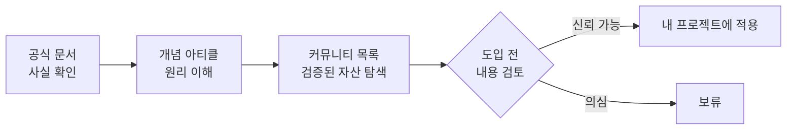

이 강의는 Claude Code 공식 문서와 여러 엔지니어링 아티클, 그리고 커뮤니티가 큐레이션한 오픈소스 저장소들을 바탕으로 집필했습니다. 더 깊이 파고들고 싶을 때 찾아갈 **참고 자료 지도**입니다.

> **먼저 한 가지:** 아래 **커뮤니티 자산은 외부 코드**입니다. 서브에이전트·스킬·플러그인·MCP 서버를 도입하기 전 **반드시 내용을 검토**하고, 신뢰할 수 있는 출처만 쓰세요. 공식 문서 외의 링크는 시점에 따라 바뀔 수 있습니다.

---

## 공식 자료 (1차 출처)

강의의 사실관계는 대부분 여기서 확인했습니다.

| 자료 | 설명 |
| --- | --- |
| **Claude Code 공식 문서** — [code.claude.com/docs](https://code.claude.com/docs) | 명령어·CLAUDE.md·서브에이전트·스킬·훅·MCP·권한·설치 등 모든 기능의 1차 레퍼런스 |
| **Anthropic Academy — Claude Code in Action** ⭐ *무료* — [anthropic.skilljar.com](https://anthropic.skilljar.com/claude-code-in-action) | Anthropic 공식 **무료 강좌**. 플랜 모드·되감기로 긴 세션 조종, CLAUDE.md·스킬·권한 설정, 예약 루틴·GitHub Actions 자동화, 무인 실행 검증·플러그인 배포까지. "몇 시간짜리 작업을 맡기고 자리를 비운 뒤 결과를 확신 있게 확인"하는 것이 목표 |
| **최신 모델 프롬프트 가이드** — [platform.claude.com/docs](https://platform.claude.com/docs/en/build-with-claude/prompt-engineering) | Opus 5·Fable 5 등 모델별 프롬프트 튜닝 공식 가이드([14장](#ch14)의 출처) |
| **anthropics/claude-code** — [github.com/anthropics/claude-code](https://github.com/anthropics/claude-code) | Claude Code 이슈 트래커·릴리스·예제(`examples/hooks` 등) |
| **Anthropic Engineering 블로그** — [anthropic.com/engineering](https://www.anthropic.com/engineering) | "Effective context engineering", "Claude Code best practices" 등 원리 아티클 |
| **공식 플러그인 마켓플레이스** — [anthropics/claude-plugins-official](https://github.com/anthropics/claude-plugins-official) | `skill-creator`·`mcp-server-dev` 등 Anthropic 공식 플러그인 |
| **Anthropic 커넥터 디렉터리** — [claude.ai/directory](https://claude.ai/directory) | 검증된 원격 MCP 커넥터 모음 (`claude mcp add`로 연결) |
| **Agent Skills 오픈 표준** — [agentskills.io](https://agentskills.io) | `SKILL.md` 포맷의 개방 표준(여러 AI 도구 호환) |

---

## 개념 아티클 (신규 개념의 출처)

[컨텍스트 엔지니어링](#ch12)·[하네스·루프 엔지니어링](#ch13) 챕터가 참고한 글들입니다.

| 자료 | 설명 |
| --- | --- |
| **Effective context engineering for AI agents** — [anthropic.com](https://www.anthropic.com/engineering/effective-context-engineering-for-ai-agents) | 컨텍스트 로트·어텐션 예산·압축/노트/서브에이전트를 정의한 Anthropic 원문 |
| **Agent Harness Engineering** — [addyosmani.com](https://addyosmani.com/blog/agent-harness-engineering/) | "에이전트 = 모델 + 하네스", Skill issue 리프레임, 하네스 구성요소 |
| **Loop · Harness · Context Engineering Explained** — [codecentric.de](https://www.codecentric.de/en/knowledge-hub/blog/loop-harness-context-engineering-explained) | 네 계층(프롬프트→컨텍스트→하네스→루프)의 명확한 정의·관계 |

---

## 커뮤니티 큐레이션 (인기 리소스 모음)

실무자들이 가장 많이 참고하는 "awesome" 목록·툴킷입니다.

| 저장소 | 설명 |
| --- | --- |
| **hesreallyhim/awesome-claude-code** — [github.com](https://github.com/hesreallyhim/awesome-claude-code) | 스킬·에이전트·상태줄·툴링·플러그인의 사실상 표준 큐레이션 |
| **rohitg00/awesome-claude-code-toolkit** — [github.com](https://github.com/rohitg00/awesome-claude-code-toolkit) | 에이전트·스킬·명령·플러그인·훅·MCP를 대량 묶은 종합 툴킷 |
| **jqueryscript/awesome-claude-code** — [github.com](https://github.com/jqueryscript/awesome-claude-code) | 도구·IDE 통합·프레임워크 중심 큐레이션 |
| **VoltAgent/awesome-claude-code-subagents** — [github.com](https://github.com/VoltAgent/awesome-claude-code-subagents) | 10개 카테고리 **100+개 전문 서브에이전트** 컬렉션 |
| **ComposioHQ/awesome-claude-skills** — [github.com](https://github.com/ComposioHQ/awesome-claude-skills) | Claude 스킬·리소스·도구 큐레이션 |
| **ai-boost/awesome-harness-engineering** — [github.com](https://github.com/ai-boost/awesome-harness-engineering) | 하네스 엔지니어링(도구·평가·기억·MCP·권한·관찰성) 목록 |

---

## 바로 쓸 만한 자산 (스킬·CLAUDE.md 예시)

| 자산 | 설명 |
| --- | --- |
| **Superpowers** | 검증된 기법·패턴을 담은 종합 **스킬 라이브러리** — Claude Code에 "초능력"을 더한다 |
| **andrej-karpathy-skills** | LLM 코딩 함정 관찰을 정리한 단일 `CLAUDE.md` — [CLAUDE.md 챕터](#ch5)의 좋은 참고 예시 |
| **관찰성(observability) 훅·대시보드** | 툴콜·서브에이전트 시작/종료·권한 이벤트를 [훅](#ch9)으로 로깅해 세션을 관측 |

---

## 어떻게 활용하면 좋은가

1. **막히면 공식 문서**부터 — 기능의 정확한 동작은 code.claude.com이 최종 근거.
2. **왜 이렇게 하나** 궁금하면 개념 아티클로 원리를 잡는다.
3. **바퀴를 다시 만들지 말고** 커뮤니티 목록에서 서브에이전트·스킬·플러그인을 찾는다.
4. **반드시 검토 후** 도입한다 — 외부 코드는 당신 권한으로 실행된다.

---

## 마치며

여기까지, **설치부터 루프 엔지니어링까지** Claude Code의 확장 기능 전반을 한 바퀴 돌았습니다. 핵심을 한 문장으로 남긴다면:

> **컨텍스트를 아끼고, 검증 수단을 주고, 실패는 설정으로 고쳐라.**

명령어·CLAUDE.md·기억·서브에이전트·스킬·훅·MCP가 [오케스트레이션](#ch11)으로 맞물리고, 그 위에 [컨텍스트](#ch12)·[하네스·루프](#ch13) 엔지니어링이 얹힐 때, Claude Code는 지켜보는 도구에서 **맡기고 자리를 비울 수 있는 시스템**으로 바뀝니다. 이제 직접 만들어 볼 차례입니다.

---

## 🎓 수료증 만들기

강의를 끝까지 읽으셨다면, 이름을 넣어 **나만의 수료증**을 만들어 PNG 이미지로 저장하세요. 진행하며 푼 퀴즈 성적도 함께 반영됩니다. 저장은 브라우저 기본 방식(다운로드 폴더 저장 · 이미지 우클릭/길게 눌러 저장)을 그대로 사용하며, 아래에 방법을 안내해 드립니다.

---

## 핵심 요약

- **1차 출처는 공식 문서**(code.claude.com)·Anthropic 엔지니어링 블로그·공식 저장소.
- 신규 개념(컨텍스트·하네스·루프)은 Anthropic 원문·Addy Osmani·codecentric 아티클에서.
- **커뮤니티 자산**(awesome-claude-code·VoltAgent 서브에이전트·Superpowers 등)은 바퀴를 다시 만들지 않게 해 주되, **도입 전 반드시 검토**하라.
- 공식 문서로 사실을 확인하고, 아티클로 원리를 잡고, 커뮤니티로 자산을 찾는 순서가 안전하다.
